# Transfer tokens via bridges

## Supported bridges

### 1. Supported tokens & channels

Currently, SubWallet supports these bridges to help you transfer tokens in-app directly:

<table><thead><tr><th width="260">Bridge</th><th>Supported tokens &#x26; channels</th></tr></thead><tbody><tr><td>Polkadot &#x3C;> Kusama Bridge</td><td><ul><li>DOT (Polkadot Asset Hub &#x3C;> Kusama Asset Hub)</li><li>KSM (Polkadot Asset Hub &#x3C;> Kusama Asset Hub)</li></ul></td></tr><tr><td>Snowbridge</td><td><ul><li>WBTC (Polkadot Asset Hub &#x3C;> Ethereum)</li><li>WETH (Polkadot Asset Hub &#x3C;> Ethereum)</li><li>MYTH (Polkadot Asset Hub &#x3C;> Ethereum)</li></ul></td></tr><tr><td>Avail Bridge*</td><td><ul><li>AVAIL (Avail &#x3C;> Ethereum)</li><li>AVAIL Turing (Avail Turing Testnet &#x3C;> Ethereum Sepolia)</li></ul></td></tr><tr><td>Unified Bridge**</td><td><ul><li>ETH (Ethereum &#x3C;> Polygon zkEVM)</li></ul></td></tr></tbody></table>


More bridges & channels will be supported soon!


_(\*): Once you initiate the transaction, you need to wait for the funds to reach the destination network. After that, you must manually claim the funds to complete the transaction._

_(\*\*): Once you initiate the transaction from Ethereum to Polygon zkEVM, you need to wait for the funds to arrive at Polygon zkEVM to complete the transaction. In the opposite channel, besides waiting, you need to claim the funds manually on Ethereum to complete the transaction._

### 2. Bridging time

<table><thead><tr><th width="359">Channel</th><th>Normal bridging time</th><th>Maximum bridging time</th></tr></thead><tbody><tr><td>
WBTC (Polkadot Asset Hub &#x3C;> Ethereum)*

WETH (Polkadot Asset Hub &#x3C;> Ethereum)*

MYTH (Polkadot Asset Hub &#x3C;> Ethereum)*
</td><td>20 - 60 minutes</td><td>2 hours</td></tr><tr><td>AVAIL (Avail → Ethereum)**</td><td>30 - 40 minutes </td><td>90 minutes</td></tr><tr><td>AVAIL (Ethereum → Avail)**</td><td>75 minutes</td><td>90 minutes</td></tr><tr><td>ETH (Ethereum → Polygon zkEVM)*</td><td>30 minutes</td><td>40 minutes</td></tr><tr><td>ETH (Polygon zkEVM → Ethereum)</td><td>2 hours 30 minutes</td><td>3 hours</td></tr></tbody></table>

_(\*): No token claiming is required for this channel._

_(\*\*): The same applies to its testnet channel._

## Transfer your tokens via Snowbridge

**Step 1**: Open the SubWallet extension and click the "**Send tokens**" button on the homepage.

<figure><figcaption></figcaption></figure>

You will be directed to the Transfer screen.

<figure><figcaption></figcaption></figure>


If you are in Single-account mode, make sure the account you initially chose is not watch-only.


**Step 2:** Enter the required information in the corresponding fields.

_In this example, we will transfer MYTH tokens on the Polkadot Asset Hub network to the Ethereum network from "Andy 2" to "Andy 1"._

First, select the token you want to transfer by clicking on the top-left field (_in this example, MYTH on Polkadot Asset Hub_).

<figure><figcaption></figcaption></figure> <figure><figcaption></figcaption></figure>

Next, select the destination network (the network you want to transfer tokens to) by clicking on the top-right field.

<figure><figcaption></figcaption></figure> <figure><figcaption></figcaption></figure>

Enter the amount and the recipient's address, then click "**Transfer**".

<figure><figcaption></figcaption></figure>


If you are in the "**All accounts**" mode, in addition to the above information, you will also need to choose the sender's address.



**Step 3**: Read the popup message carefully, then click "**Continue**" to proceed.


The cross-chain transaction on Snowbridge usually incurs a high fee and can take from 20 minutes to more than 2 hours to complete, depending on the bridge's status. Transfer at your own risk!


<figure><figcaption></figcaption></figure>

**Step 3**: Check your transaction details, then click "**Approve**" to proceed.&#x20;

<figure><figcaption></figcaption></figure>

**Step 4**: Transaction result is in!

<figure><figcaption></figcaption></figure>

You can either click "**Back to home**" to return to the homepage or "**View transaction**" to see transaction details in the History tab.


If you click "**View transaction**", SubWallet will show you the latest transaction record in your transaction history along with the extrinsic hash of the transfer.&#x20;


## Transfer your tokens via Avail Bridge & Unified Bridge


With these bridges, except for the ETH transfer from Ethereum to Polygon zkEVM, you must claim the funds on the destination network to complete the transaction.


### Transfer tokens to the destination network

**Step 1**: Open the SubWallet extension and click the "**Send tokens**" button on the homepage.

<figure>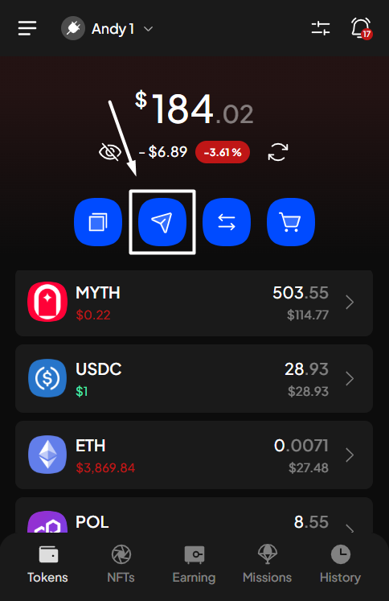<figcaption></figcaption></figure>

You will be directed to the Transfer screen.

<figure>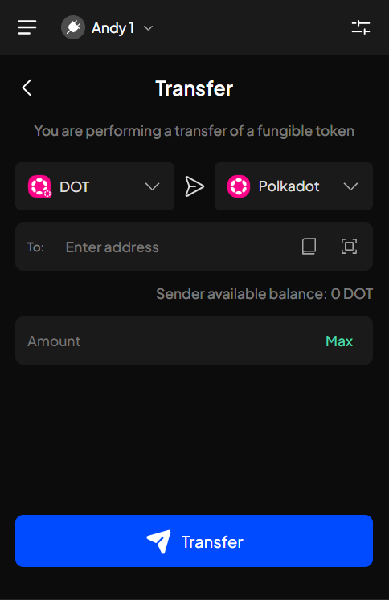<figcaption></figcaption></figure>


If you are in Single-account mode, make sure the account you initially chose is not watch-only.


**Step 2:** Enter the required information in the corresponding fields.

_In this example, we will transfer AVAIL Turing tokens on the Avail Turing testnet network to the Ethereum Sepolia network within account "Andy 1"._

First, select the token you want to transfer by clicking on the top-left field.

<figure>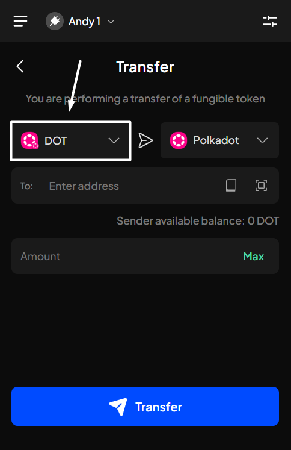<figcaption></figcaption></figure> <figure>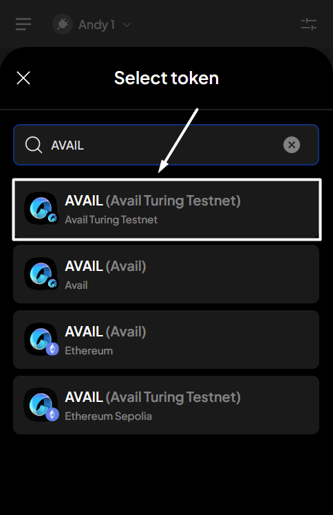<figcaption></figcaption></figure>

Next, select the destination network (the network you want to transfer tokens to) by clicking on the top-right field.

<figure>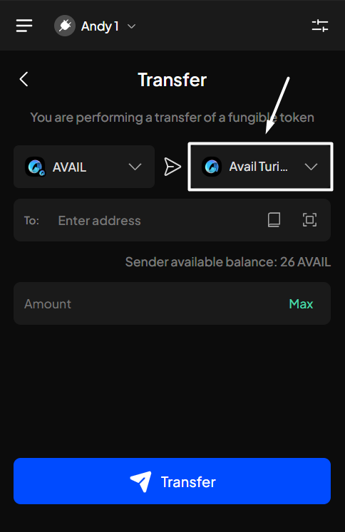<figcaption></figcaption></figure> <figure>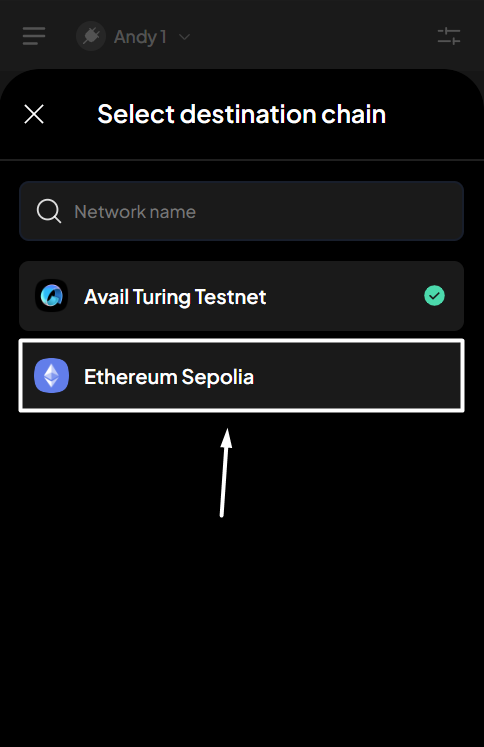<figcaption></figcaption></figure>

Enter the amount and the recipient's address, then click "**Transfer**".

<figure>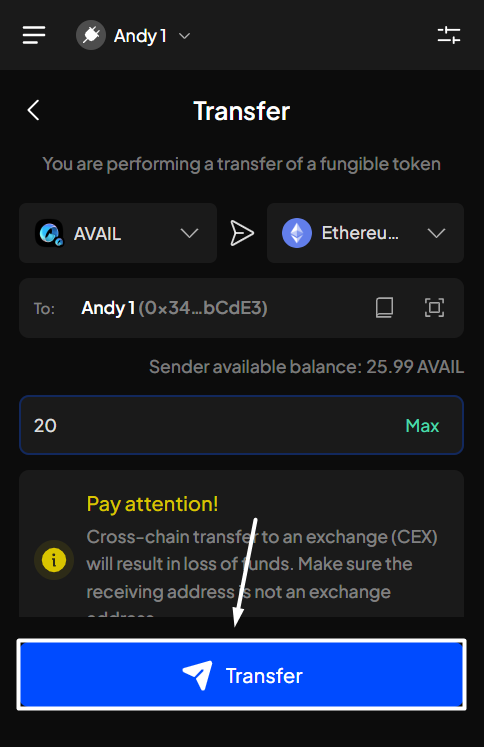<figcaption></figcaption></figure>


If you are in the "**All accounts**" mode, in addition to the above information, you will also need to choose the sender's address.

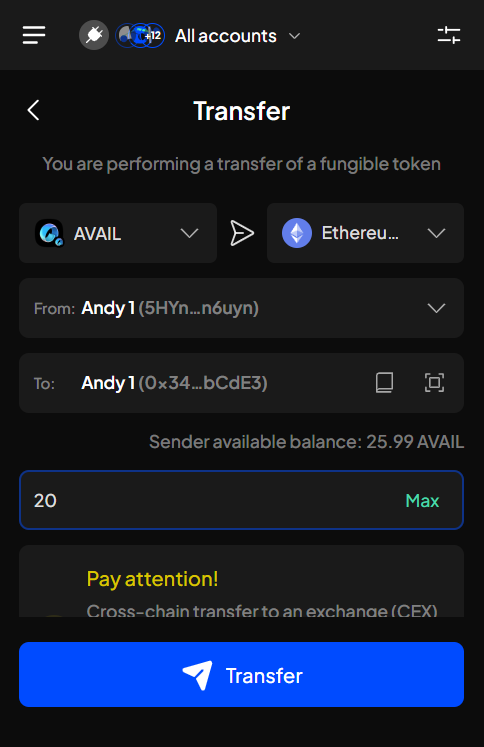


**Step 3**: Read the popup message carefully, then click "**Continue**" to proceed.


The cross-chain transaction on Avail Bridge can take 30 to 75 minutes for the tokens to arrive at the destination network, depending on the bridge's status. Transfer at your own risk!


<figure>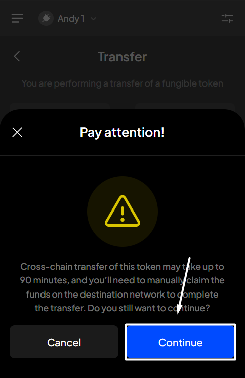<figcaption></figcaption></figure>

**Step 3**: Check your transaction details, then click "**Approve**" to proceed.&#x20;

<figure>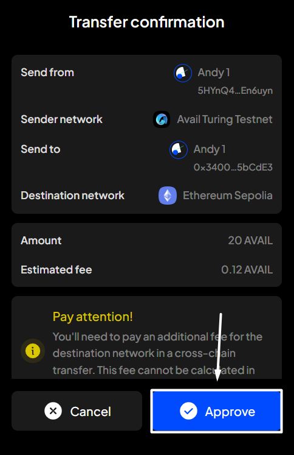<figcaption></figcaption></figure>

**Step 4**: Your transaction has been summited!

<figure><figcaption></figcaption></figure>

You can either click "**Back to home**" to return to the homepage or "**View transaction**" to see transaction details in the History tab.


If you click "**View transaction**", SubWallet will show you the latest transaction record in your transaction history along with the extrinsic hash of the transfer.&#x20;

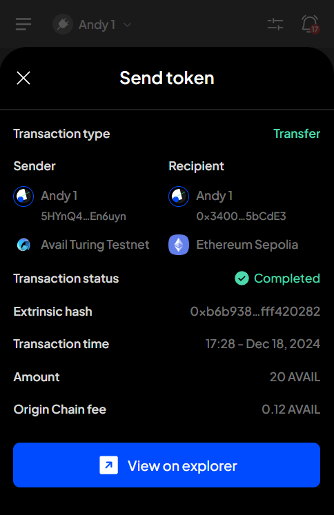



Please be aware that even though the transaction status indicates "**Completed**", this simply means that the tokens are on their way to the destination network. To complete this transaction, you must manually claim the funds on that network.


### Claim tokens on the destination network


If you transfer ETH from Ethereum to Polygon zkEVM, you won't need to follow the steps below, as the tokens will be credited to the destination network after the bridging time ends.


**Step 5**: On the SubWallet homepage, click on the  button at the top right of the screen.

<figure>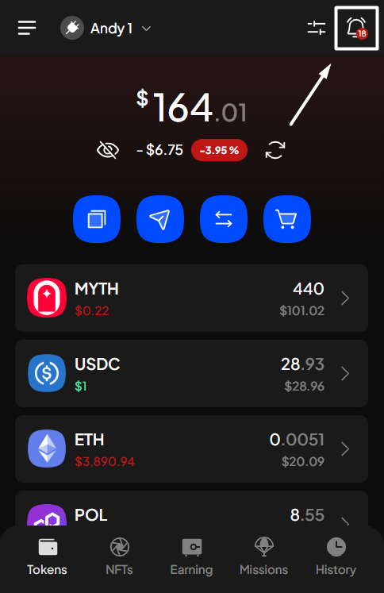<figcaption></figcaption></figure>

In the Notifications screen, look for the notification related to claiming bridged tokens, then click on that notification.

<figure>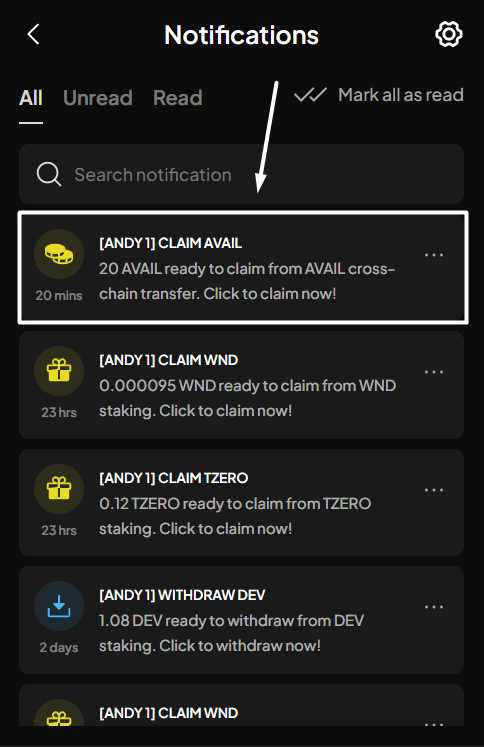<figcaption></figcaption></figure>

**Step 6**: You will be directed to the Claim tokens screen. Click "**Continue**" to proceed.

<figure>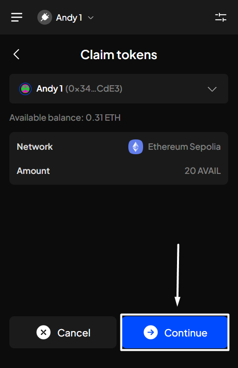<figcaption></figcaption></figure>

**Step 7**: Check your transaction details, then click "**Approve**" to proceed.

<figure>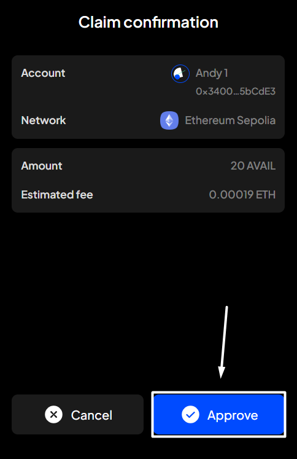<figcaption></figcaption></figure>

**Step 8**: Your transaction has been summited!

<figure><figcaption></figcaption></figure>

You can either click "**Back to home**" to return to the homepage or "**View transaction**" to see transaction details in the History tab.


If you click "**View transaction**", SubWallet will show you the latest transaction record in your transaction history along with the extrinsic hash of the transfer.&#x20;

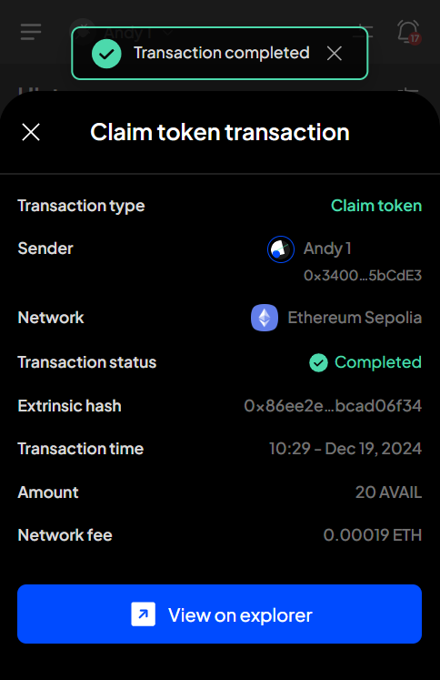

