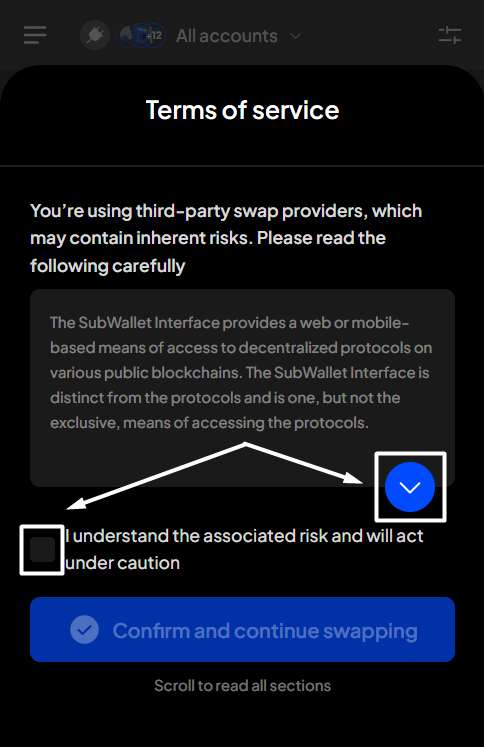
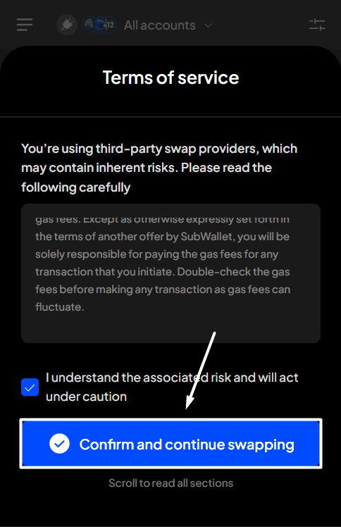
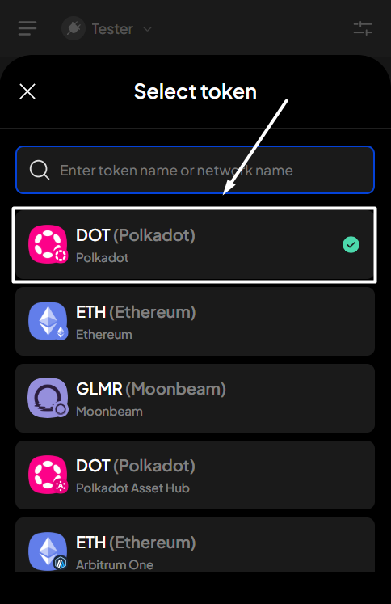
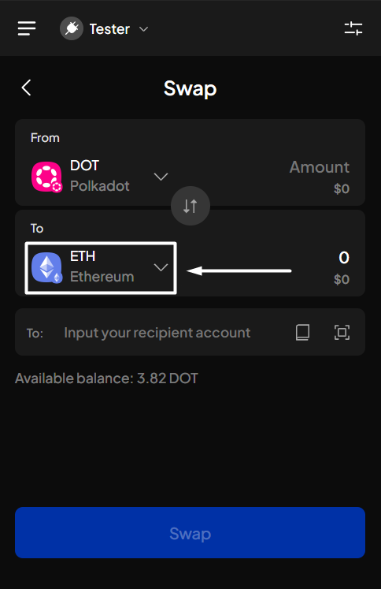
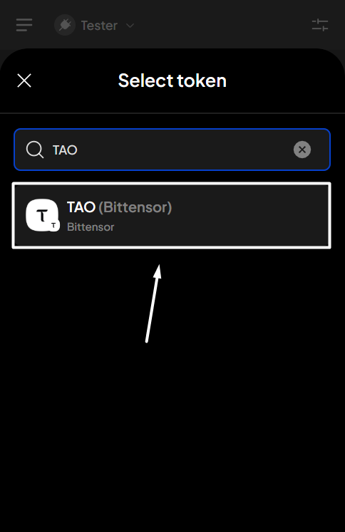
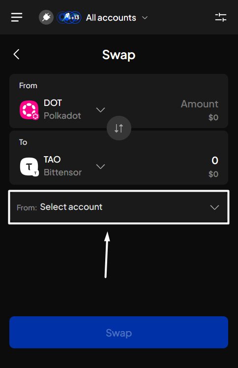
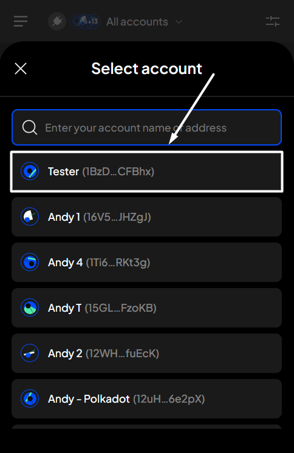
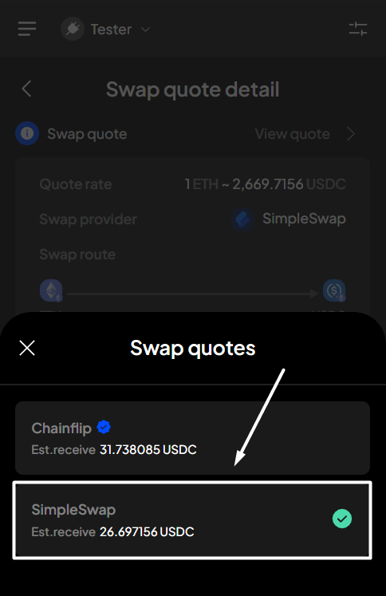
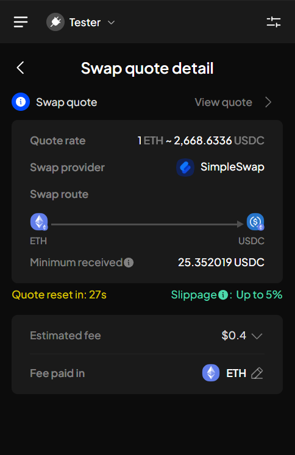
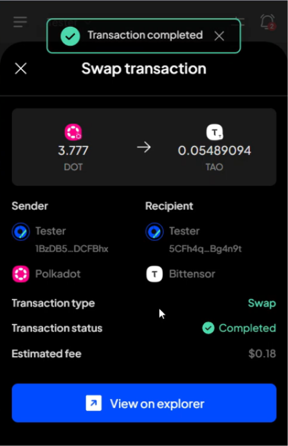

# Cross-chain swap

## Supported swap pairs & swap providers

### Cross-chain swap on the Polkadot ecosystem

<table><thead><tr><th>Swap provider</th><th width="412">Supported swap pair</th></tr></thead><tbody><tr><td><ul><li>SimpleSwap</li></ul></td><td><ul><li>DOT (Polkadot) &#x3C;> TAO (Bittensor)</li></ul></td></tr></tbody></table>

### Cross-chain swap on the Ethereum ecosystem

<table><thead><tr><th>Swap provider</th><th width="413">Supported swap pair</th></tr></thead><tbody><tr><td><ul><li>ChainFlip</li></ul></td><td><ul><li>ETH (Ethereum) &#x3C;> USDC (Arbitrum One)</li><li>USDT (Ethereum) &#x3C;> USDC (Arbitrum One)</li><li>ETH (Arbitrum One) &#x3C;> USDC (Ethereum)</li><li>ETH (Arbitrum One) &#x3C;> USDT (Ethereum)</li><li>FLIP (Ethereum) &#x3C;> ETH (Arbitrum One)</li><li>FLIP (Ethereum) &#x3C;> USDC (Arbitrum One)</li></ul></td></tr><tr><td><ul><li>KyberSwap</li></ul></td><td><ul><li>1000+ swap pairs across 10+ networks</li></ul></td></tr></tbody></table>

### Cross-chain swap between Polkadot & Ethereum ecosystem

<table><thead><tr><th>Swap provider</th><th width="413">Supported swap pair</th></tr></thead><tbody><tr><td><ul><li>ChainFlip</li><li>SimpleSwap</li></ul></td><td><ul><li>DOT (Polkadot) &#x3C;> ETH (Ethereum)</li><li>DOT (Polkadot) &#x3C;> USDC (Ethereum)</li><li>DOT (Polkadot) &#x3C;> USDT (Ethereum)</li></ul></td></tr><tr><td><ul><li>ChainFlip</li></ul></td><td><ul><li>DOT (Polkadot) &#x3C;> FLIP (Ethereum)</li><li>DOT (Polkadot) &#x3C;> USDC (Arbitrum One)</li><li>DOT (Polkadot) &#x3C;> ETH (Arbitrum One)</li></ul></td></tr><tr><td><ul><li>SimpleSwap</li></ul></td><td><ul><li>TAO (Bittensor) &#x3C;> ETH (Ethereum)</li><li>TAO (Bittensor) &#x3C;> USDC (Ethereum)</li><li>TAO (Bittensor) &#x3C;> USDT (Ethereum)</li></ul></td></tr></tbody></table>


With this type of swap, you can choose to swap your tokens to another account.


## Swap tokens

**Step 1**: Open the SubWallet extension and click the "**Swap**" button on the homepage.

<figure><figcaption></figcaption></figure> <figure><figcaption></figcaption></figure>


If this is the first time you click the button, the Terms of service popup will appear. Read carefully, then select "**I understand the associated risk and will act under caution**". After that, click "**Confirm and continue swapping**".



**Step 2**: On the Swap screen, select the token you want to swap and the token you wish to receive.

_In this example, we want to swap DOT (Polkadot) for TAO (Bittensor)._

Select "**DOT (Polkadot)**" as the token you want to swap.

<figure><figcaption></figcaption></figure> <figure><figcaption></figcaption></figure>

Select "**TAO (Bittensor)**" as the token you wish to receive.

<figure><figcaption></figcaption></figure> <figure><figcaption></figcaption></figure>


If you are in the "**All accounts**" mode, you will need to select the swapping account.



Enter the amount you want to swap. Once done, the swap quote (with the related information) will appear.&#x20;

Click "**Swap**" to proceed.

<figure><figcaption></figcaption></figure>

If you want to change the swap provider

:information\_source: _This feature is available for swap pairs on the Ethereum network._

To do that, hit the "**View swap quote**" button, then continue clicking on the "**View quote**" button.

In the Swap quotes popup, choose the provider you want for the swap.


You cannot change the slippage tolerance with this swap type:

* With ChainFlip, every swap has a fixed slippage tolerance of 2%.
* With SimpleSwap, the slippage tolerance can't be predicted as it varies based on market conditions, but it will never exceed 5%.


**Step 3**: Check your transaction details, then click "**Approve**" to proceed.

<figure><figcaption></figcaption></figure>


Swapping via SimpleSwap can take 5 to 60 minutes, depending on the market conditions.


**Step 4**: Your swapping request has been submitted!

<figure><figcaption></figcaption></figure>

You can either click "**Back to home**" to return to the homepage or "**View transaction**" to see transaction details in the History tab.


If you click "**View transaction**", SubWallet will show you the latest transaction record in your transaction history along with the extrinsic hash of the transfer.


