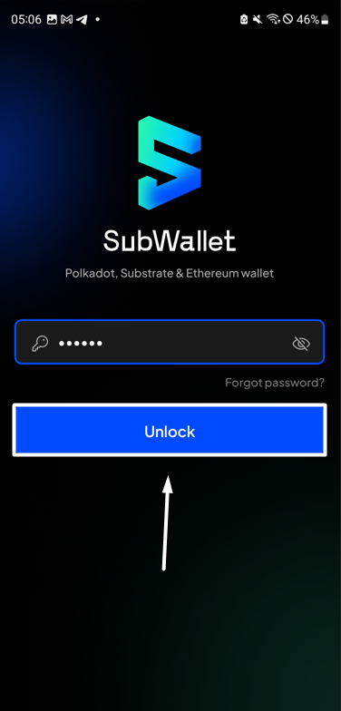
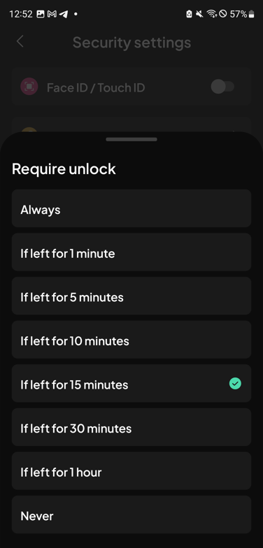
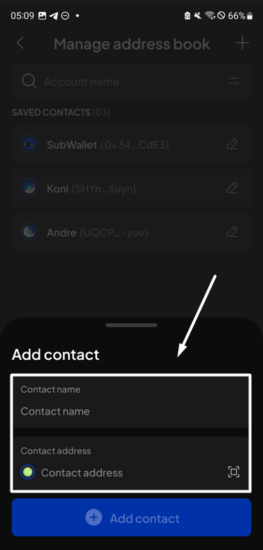
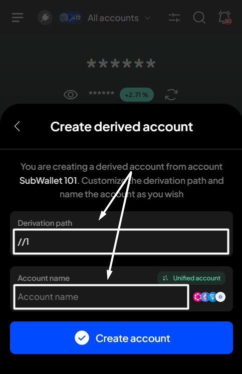
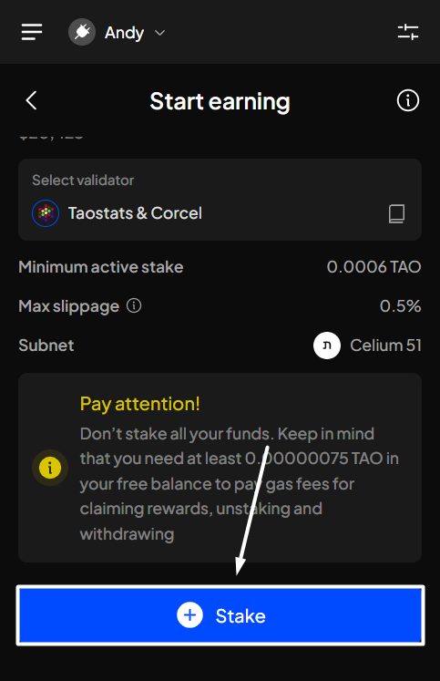
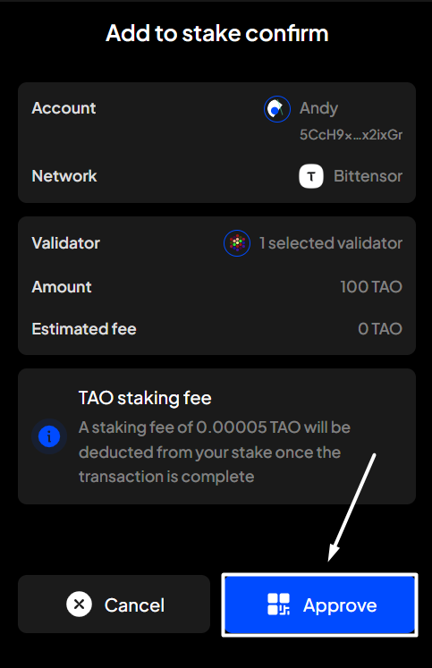

# Cast vote for a referendum

## Supported voting directions

SubWallet supports all 4 possible voting directions for a referendum:

* **Aye**: Vote in favor of the referendum
* **Nay**: Vote against the referendum
* **Split**: Split your voting power into both Aye & Nay
* **Abstain**: Vote counts for the referendum support (total voting balance) but not for its approval


- When you choose **Split** or **Abstain**, your vote is always counted with the fixed conviction multiplier (**0.1x**)
- When you vote **Aye** or **Nay**, you can select your conviction multiplier from **0.1x up to 6x**.


## Conviction & Lock-up period&#x20;

Polkadot utilizes an idea called voluntary locking that allows token holders to increase their voting power by declaring how long they are willing to lock up their tokens; hence, the number of votes for each token holder will be calculated by the following formula:

> 
<strong>Votes = Tokens x Conviction Multiplier</strong>

The greater the conviction, the greater your voting power, and the longer the tokens will be locked for that referendum. Particularly:

<table><thead><tr><th data-type="number">Lock Period (1 period = 7 days)</th><th>Conviction</th><th data-type="number">Length in Days</th></tr></thead><tbody><tr><td>0</td><td>0.1x</td><td>0</td></tr><tr><td>1</td><td>1x</td><td>7</td></tr><tr><td>2</td><td>2x</td><td>14</td></tr><tr><td>4</td><td>3x</td><td>28</td></tr><tr><td>8</td><td>4x</td><td>56</td></tr><tr><td>16</td><td>5x</td><td>112</td></tr><tr><td>32</td><td>6x</td><td>224</td></tr></tbody></table>

## Cast your votes

**Step 1**: Open the SubWallet extension and select the "**Governance**" tab at the bottom of the screen.

<figure><figcaption></figcaption></figure>


The Governance feature is available only for Polkadot-supported accounts. If you are currently in either single-account mode or all-accounts mode and none of your accounts support the Polkadot ecosystem, you will see a toast error when trying to click on the tab.


**Step 2**: In the Governance screen, select the network in which you want to see referendums.

_In this case, we'll select the Polkadot Asset Hub network_.

<figure><figcaption></figcaption></figure> <figure><figcaption></figcaption></figure>

You'll see the referenda list for the chosen network.

<figure><figcaption></figcaption></figure>

**Step 3**: Select an ongoing referendum by clicking the "**Ongoing**" tab, scrolling down, or searching using the  icon. Once done, click on that referendum to view its details.

<figure><figcaption></figcaption></figure> <figure><figcaption></figcaption></figure>

**Step 4**: In the Referendum details screen, select "**Vote**" to start voting for your chosen referendum.

<figure><figcaption></figcaption></figure>


If you're in "**All accounts**" mode, you will need to select the account you want to use for voting first. If you're in Single account mode, skip this and go to **Step 5**.



**Step 5**: Fill in the required information, such as voting amount and voting multiplier (conviction).

<figure><figcaption></figcaption></figure>


You can select either "**Use governance lock**" or "**Use all locks**" to fill in the Amount field.

* Use governance lock: your entire current lock balance due to on-chain voting/delegating will be used to vote.
* Use all locks: your entire locked balance (due to staking, governance, etc.) will be used to vote.

.png>)


Once done, select the direction you want to vote. _In this example, we will vote "Aye" for the referendum._

<figure><figcaption></figcaption></figure>


If you want to vote "Abstain" or "Split", as your vote is always counted with the fixed conviction multiplier (0.1×), **you will need to choose the vote direction first, then enter the amount you want to vote**:

* For "_Split_": enter **Aye & Nay** amount
* For "_Abstain_": enter **Aye, Nay & Abstain** amount

_**Your total voting power will be calculated as the sum of the entered amounts multiplied by the fixed conviction multiplier (0.1×).**_

Once you have entered the desired amounts, click **“Vote”** to proceed.

  


**Step 6**: Check the information and confirm your voting request by clicking "**Approve**".

<figure><figcaption></figcaption></figure>

**Step 7**: Your voting request has been submitted!

<figure><figcaption></figcaption></figure>

You can either click "**Back to home**" to return to the homepage or "**View transaction**" to see transaction details in the History tab.


If you click "**View transaction**", SubWallet will display the latest transaction record in your transaction history, along with the extrinsic hash of the transfer.



To view your votes on the referendum, repeat the first 3 steps of the guide. Your votes will then appear on that referendum page.

<figure><figcaption></figcaption></figure>
