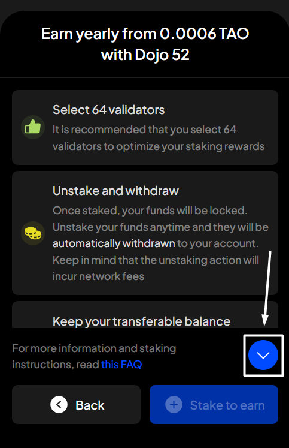
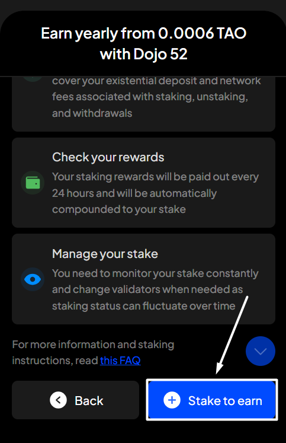
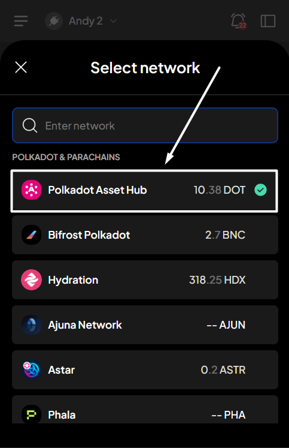
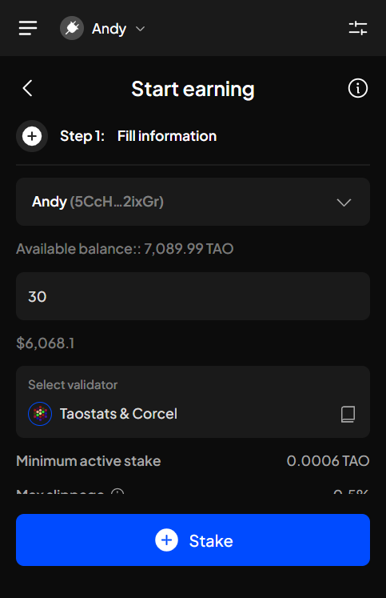
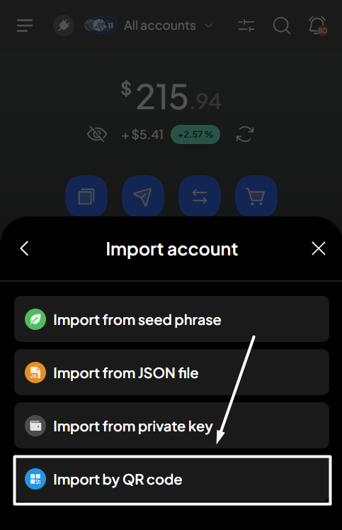
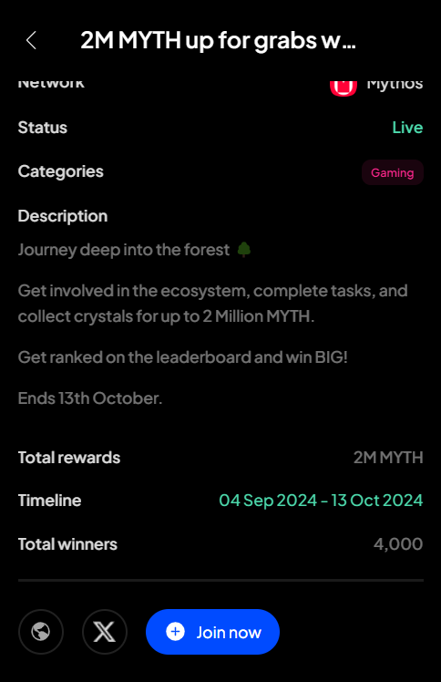

# Revote for a referendum


Same as you would for voting, you can revote for a referendum in any direction—**Aye, Nay, Split & Abstain**.

In addition, you can **unvote** at any time to remove votes from a referendum you’ve previously voted on.


**Step 1**: Open the SubWallet extension and select the "**Governance**" tab at the bottom of the screen.

<figure><figcaption></figcaption></figure>


The Governance feature is available only for Polkadot-supported accounts. If you are currently in either single-account mode or all-accounts mode and none of your accounts support the Polkadot ecosystem, you will see a toast error when trying to click on the tab.


**Step 2**: In the Governance screen, select the network in which you want to see referendums.

_In this case, we'll select the Polkadot Asset Hub network_.

<figure><figcaption></figcaption></figure> <figure><figcaption></figcaption></figure>

You'll see the referenda list for the chosen network.

**Step 3**: Select an ongoing referendum by clicking the "**Ongoing**" tab, scrolling down, or searching using the  icon. Once done, click on that referendum to view its details.

<figure><figcaption></figcaption></figure>

**Step 4**: In the Referendum details screen, select "**Revote**" to adjust your voting for the chosen referendum.

<figure><figcaption></figcaption></figure>


If you're in "**All accounts**" mode, you can revote by clicking the "**Vote**" button and then selecting any voted account from the list.

.png>)  


**Step 5**: Fill in the required information, such as voting amount and voting multiplier (conviction).

<figure><figcaption></figcaption></figure>


You can select either "**Use governance lock**" or "**Use all locks**" to fill in the Amount field.

* Use governance lock: your entire current lock balance due to on-chain voting/delegating will be used to vote.
* Use all locks: your entire locked balance (due to staking, governance, etc.) will be used to vote.

.png>)


Once done, select the direction you want to vote, or click the "**Unvote**" button at the top right corner of the screen to remove your votes.&#x20;

_In this example, we will vote "Aye" for the referendum._

<figure><figcaption></figcaption></figure>


If you want to vote "Abstain" or "Split", as your vote is always counted with the fixed conviction multiplier (0.1×), **you will need to choose the vote direction first, then enter the amount you want to vote**:

* For "_Split_": enter **Aye & Nay** amount
* For "_Abstain_": enter **Aye, Nay & Abstain** amount

_**Your total voting power will be calculated as the sum of the entered amounts multiplied by the fixed conviction multiplier (0.1×).**_

Once you have entered the desired amounts, click **“Vote”** to proceed.

  


**Step 6**: Check the information and confirm your re-voting request by clicking "**Approve**".

<figure><figcaption></figcaption></figure>

**Step 7**: Your voting request has been submitted!

<figure><figcaption></figcaption></figure>

You can either click "**Back to home**" to return to the homepage or "**View transaction**" to see transaction details in the History tab.


If you click "**View transaction**", SubWallet will display the latest transaction record in your transaction history, along with the extrinsic hash of the transfer.



To view your updated votes on the referendum, repeat the first 3 steps of the guide. Your votes will then appear on that referendum page.

<figure><figcaption></figcaption></figure>
