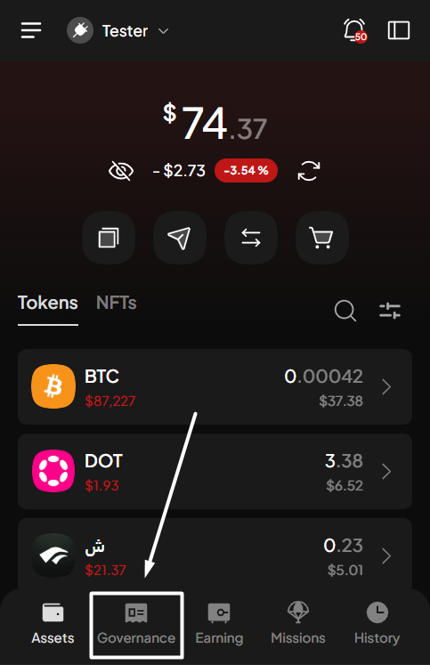
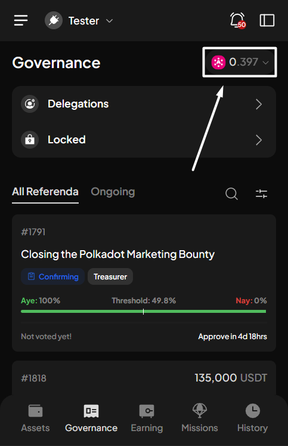
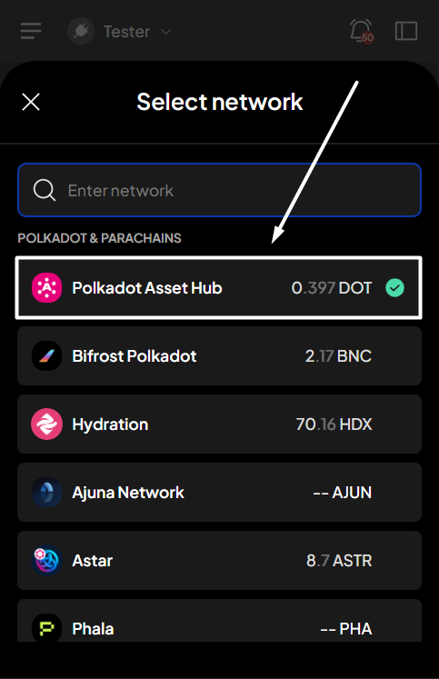
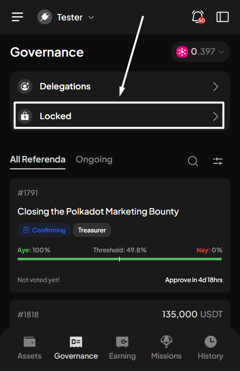
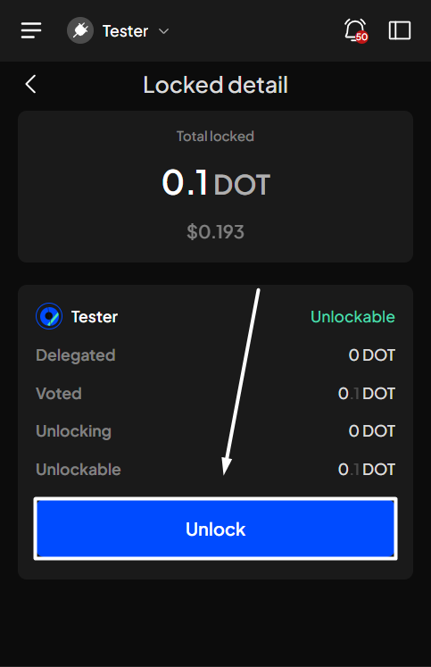
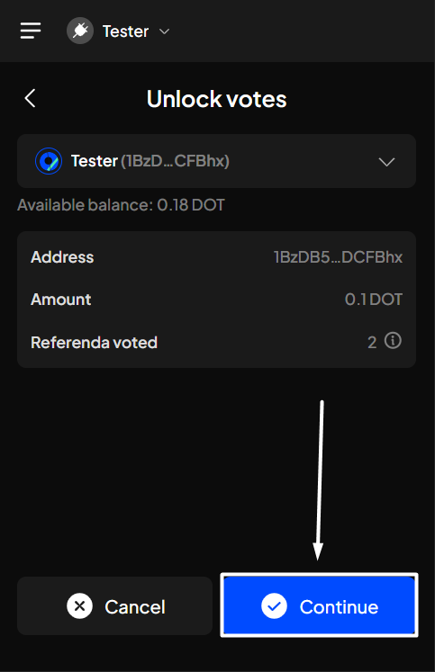
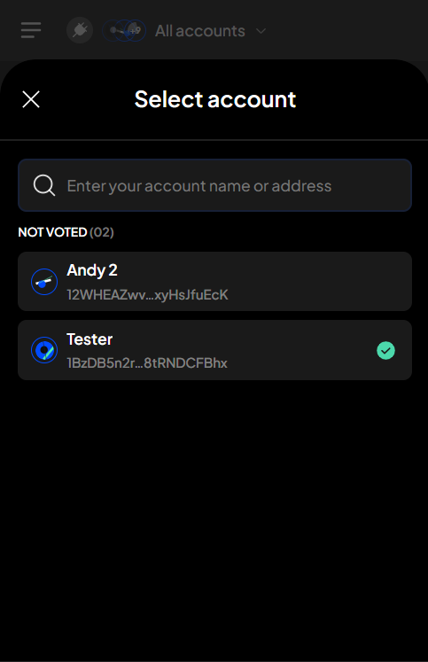
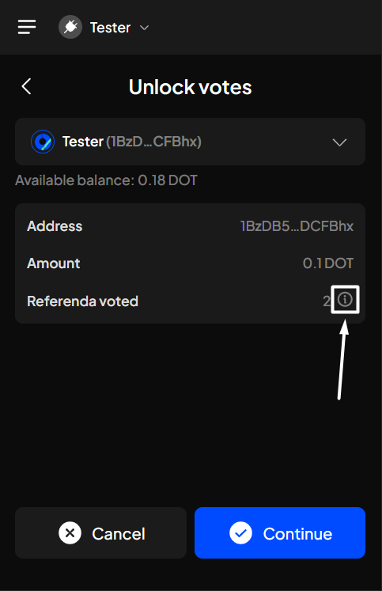
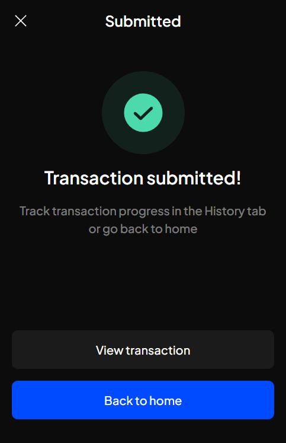

# Unlock expired votes

When a referendum ends, the balance you used to vote with remains locked in place. If you had voted without conviction or with the losing side, you can immediately unlock that balance. Otherwise, the lock expires once the locking period passes.

Once a lock has expired, you can remove the vote and lock.&#x20;

**Step 1**: Open the SubWallet extension and select the "**Governance**" tab at the bottom of the screen.

<figure><figcaption></figcaption></figure>


The Governance feature is available only for Polkadot-supported accounts. If you are currently in either single-account mode or all-accounts mode and none of your accounts support the Polkadot ecosystem, you will see a toast error when trying to click on the tab.


**Step 2**: In the Governance screen, select the network in which you want to see referendums.

<figure><figcaption></figcaption></figure> <figure><figcaption></figcaption></figure>

_In this case, we'll select the Polkadot Asset Hub network_.

You'll see the referenda list for the chosen network.

**Step 3**: Select the "**Locked**" fields to see your governance-locked details.

<figure><figcaption></figcaption></figure>

**Step 4**: In the Locked screen, click the "**Unlock**" button.

<figure><figcaption></figcaption></figure>


The "**Unlock**" button is clickable as long as you have any expired votes, even if the unlockable amount is 0.

.png>)


**Step 5**: In the Unlock votes screen, click "**Continue**" to proceed.

<figure><figcaption></figcaption></figure>


If you're in the "**All accounts**" mode, you can select the account that has expired votes to unlock.

  



You can view the referendum IDs associated with your expired votes by clicking the info icon.

  .png>)


**Step 6**: Check the information and confirm your unlock request by clicking "**Approve**".

<figure><figcaption></figcaption></figure>

**Step 7**: Your unlock request has been submitted!

<figure><figcaption></figcaption></figure>

You can either click "**Back to home**" to return to the homepage or "**View transaction**" to see transaction details in the History tab.


If you click "**View transaction**", SubWallet will display the latest transaction record in your transaction history, along with the extrinsic hash of the transfer.


