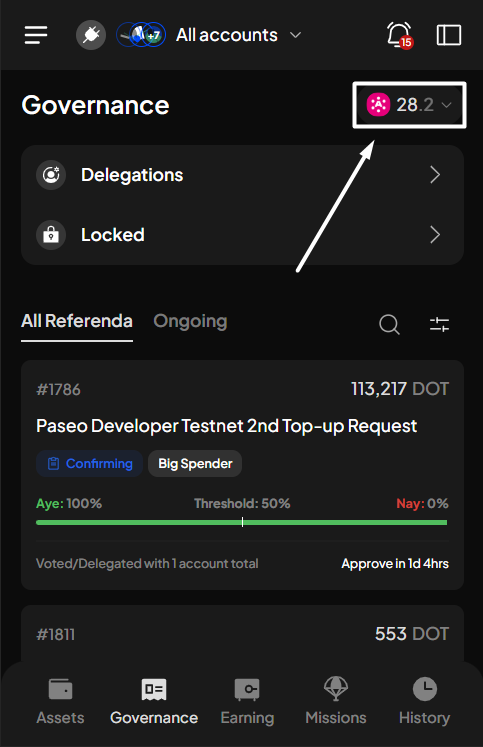

# View & manage referendums

## Search & filter referendums

### Search referendums

**Step 1**: Open the SubWallet extension and select the "**Governance**" tab at the bottom of the screen.

<figure><figcaption></figcaption></figure>


The Governance feature is available only for Polkadot-supported accounts. If you are currently in either single-account mode or all-accounts mode and none of your accounts support the Polkadot ecosystem, you will see a toast error when trying to click on the tab.


**Step 2**: In the Governance screen, select the network in which you want to see referendums.

<figure><figcaption></figcaption></figure> <figure><figcaption></figcaption></figure>

You'll see the list of referenda for the chosen network.

<figure><figcaption></figcaption></figure>

**Step 3**: Click the  icon to open the Referenda list screen.

<figure><figcaption></figcaption></figure>

**Step 4**: On this screen, type the referendum ID or a part of the referendum title in the search bar.&#x20;

<figure><figcaption></figcaption></figure>

Any referendums that match the number or keywords you entered will appear.

<figure><figcaption></figcaption></figure>

### Filter referendums

**Step 1**: Open the SubWallet extension and select the "**Governance**" tab at the bottom of the screen.

<figure><figcaption></figcaption></figure>


The Governance feature is available only for Polkadot-supported accounts. If you are currently in either single-account mode or all-accounts mode and none of your accounts support the Polkadot ecosystem, you will see a toast error when trying to click on the tab.


**Step 2**: In the Governance screen, select the network in which you want to see referendums.

<figure><figcaption></figcaption></figure> <figure><figcaption></figcaption></figure>

You'll see the list of referenda for the chosen network.&#x20;

<figure><figcaption></figcaption></figure>

**Step 3**: Click the  icon to open the Filter popup screen.

<figure><figcaption></figcaption></figure>

You can filter referendums with the following criteria:

> * _Treasury-related only_: this toggle, when enabled, will only display referendums that request treasury
> * _Status_: Every referendum has a current status (for example, ongoing or completed). You can view only referendums with a specific status by selecting it in the filter.
> * _Track_: Every referendum belongs to a specific track. You can view only referendums from a chosen track by selecting it in the filter.

<figure><figcaption></figcaption></figure>


You can filter referendums by applying all 3 criteria.


**Step 4**: Select how you'd like to filter referendums and then click "**Apply filter**".

If you want to filter referendums by status

In the Filter screen, click on the "**Status**" field. Select the status you want to filter referendums.

<figure><figcaption></figcaption></figure> <figure><figcaption></figcaption></figure>

Once done, if you don't want to also filter referendums by track, click "**Apply filter**".

<figure><figcaption></figcaption></figure>

If you want to filter referendums by track

In the Filter screen, click on the "**Track**" field. Select the track you want to filter referendums.

<figure><figcaption></figcaption></figure> <figure><figcaption></figcaption></figure>

Once done, if you don't want to also filter referendums by status, click "**Apply filter**".

<figure><figcaption></figcaption></figure>

Once you’ve applied the filter, all referenda that match your criteria will appear.


You can also filter ongoing referendums by selecting the "Ongoing" tab in the Governance screen. Once selected, only referendums that are currently ongoing will show up.

 .png>)


## View referendum details

After you've done searching & filtering referendums, you can view referendum details by clicking on that referendum.

<figure><figcaption></figcaption></figure>

Once you've selected a referendum, the Referenda details screen will appear, where you can view all information related to that referendum, such as:

* Voting stats & voting details
* Referendum description, details & timeline
* The corresponding Polkassembly & Subsquare page of the referendum

<figure><figcaption></figcaption></figure> <figure><figcaption></figcaption></figure>

