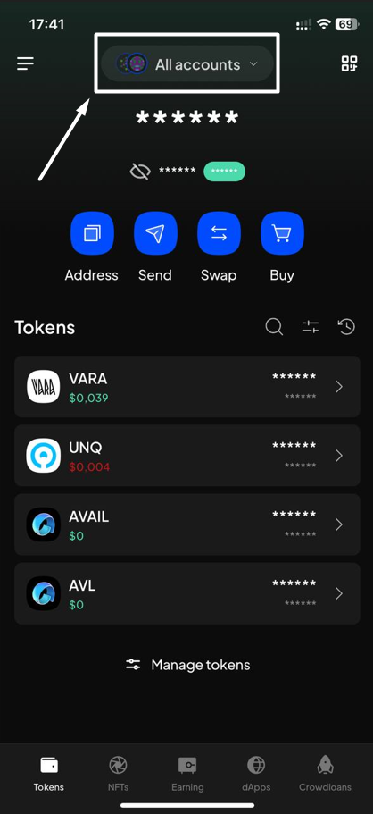
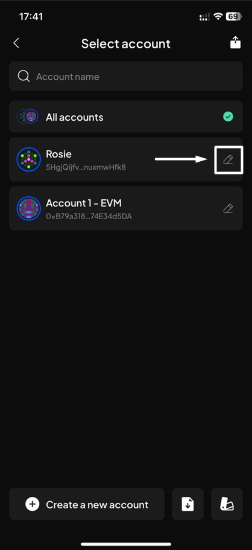
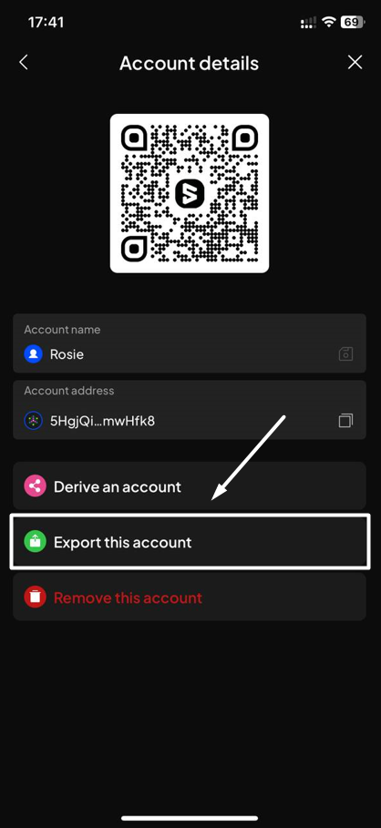
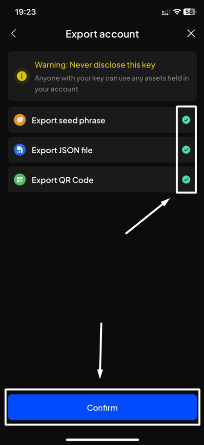
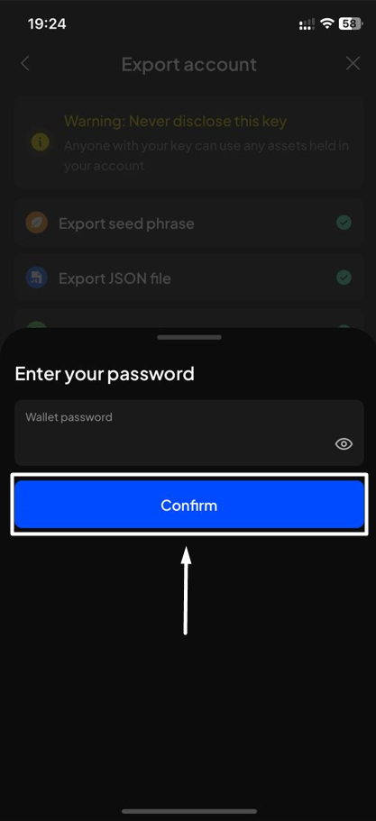
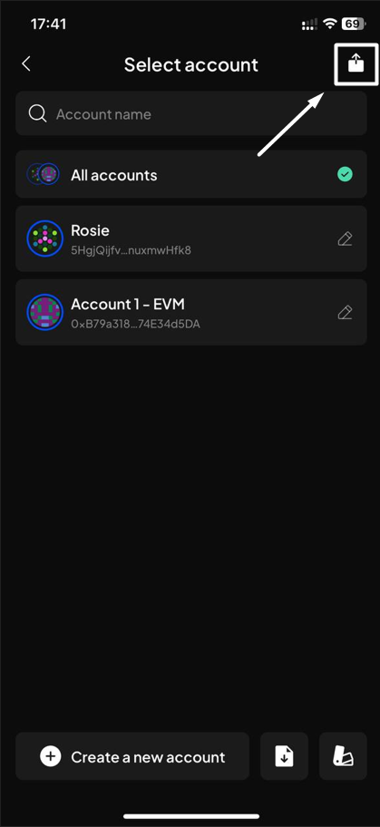
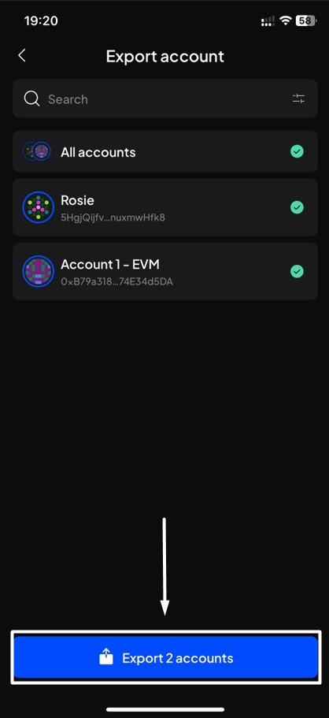
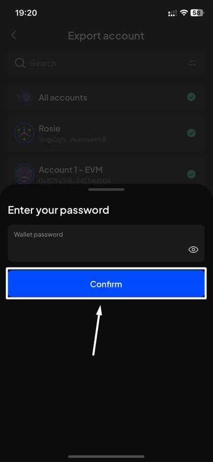
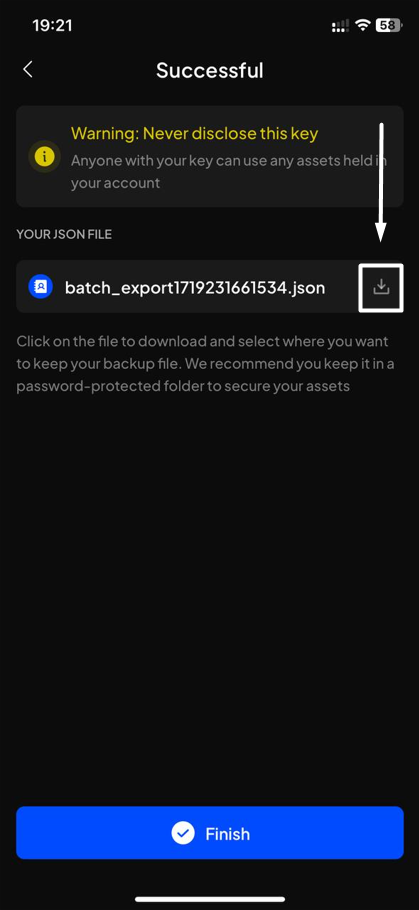

# Export & backup accounts

### Export & backup an account

Export your private key in different forms of backup files, and use these files to restore & import the account again if you so wish.

Depending on the type of account you want to export, SubWallet supports different export methods:

| Account's type               | Supported export method                                                                                         |
| ---------------------------- | --------------------------------------------------------------------------------------------------------------- |
| Polkadot (Substrate) account | <ul><li>Export seed phrase</li><li>Export JSON file</li><li>Export QR code</li></ul>                            |
| Ethereum (EVM) acccount      | <ul><li>Export seed phrase</li><li>Export JSON file</li><li>Export private key</li><li>Export QR code</li></ul> |
| Watch-only account           | None                                                                                                            |
| Ledger account               | None                                                                                                            |
| QR-signer account            | None                                                                                                            |

**Step 1**: Open SubWallet and click on the account name at the top of the screen to get to the account selection tab.

<figure><figcaption></figcaption></figure>

**Step 2**: In the account selection tab, click the pencil icon on the right-hand side of the account you want to export.&#x20;

<figure><figcaption>
In this example, we chose account "Rosie" - a Polkadot account - to export.
</figcaption></figure>

**Step 3**: Choose "**Export this account**".

<figure><figcaption></figcaption></figure>

**Step 4**: Choose your preferred way(s) to export your account and click "**Confirm**".

As "Rosie" is a Polkadot account, there are 3 options to export the account, as listed in the table above.

<figure><figcaption></figcaption></figure>

&#x20;**Step 5**: Enter your password and click "**Confirm**".&#x20;

<figure><figcaption></figcaption></figure>

**Step 6**: Your backup information has been exported!

Scroll to see all your backups and click the "**Finish**" button below to return to the homepage.&#x20;

<figure><figcaption></figcaption></figure>

 

<figure><figcaption></figcaption></figure>


Please save and keep your backup files secure.&#x20;

Furthermore, you would need these backup files to restore your account in case you forget your SubWallet password.



**Don't share your seed phrase with anyone, including us.**&#x20;

SubWallet is non-custodial, which means we don't store any of your backup information to ensure user privacy and security.


### Export multiple accounts


This feature allows users to export the backup information of multiple accounts (whether Polkadot accounts or Ethereum accounts) in the form of **one JSON file**.


**Step 1**: Open SubWallet and click on the account name to get to the account selection tab.

<figure><figcaption></figcaption></figure>

**Step 2**: In the account selection tab, click on the export icon  at the top right of the screen.

<figure><figcaption></figcaption></figure>

**Step 3**: In the Export account screen, select as many accounts to export as you wish.

In this example, we want to export all accounts. Once done, click on the "**Export 2 accounts**" button.

<figure><figcaption></figcaption></figure>

**Step 4**: Enter your password to confirm, then click "**Confirm**" to proceed.

<figure><figcaption></figcaption></figure>

**Step 5**: A JSON file will be created. Click on the download icon to download the file and keep it in a safe place.&#x20;

<figure><figcaption></figcaption></figure>

You have successfully exported multiple accounts! Click "**Finish**" to return to the homepage.
