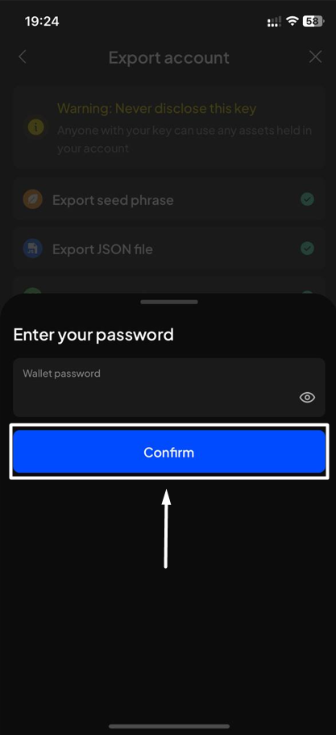

# Export & backup accounts

### Supported export methods

Export your private key in different forms of backup files, and use these files to restore & import the account again if you so wish.

Depending on the type of account you want to export, SubWallet supports different export methods:

<table><thead><tr><th width="252">Account type</th><th width="133" data-type="checkbox">Seed phrase</th><th width="128" data-type="checkbox">JSON file*</th><th width="118" data-type="checkbox">Private key</th><th width="119" data-type="checkbox">QR code</th></tr></thead><tbody><tr><td>Unified account</td><td>true</td><td>true</td><td>false</td><td>false</td></tr><tr><td>Substrate account</td><td>true</td><td>true</td><td>false</td><td>true</td></tr><tr><td>EVM account</td><td>true</td><td>true</td><td>true</td><td>true</td></tr><tr><td>TON account</td><td>true</td><td>true</td><td>true</td><td>false</td></tr><tr><td>QR-signer account</td><td>false</td><td>true</td><td>false</td><td>false</td></tr><tr><td>Watch-only account**</td><td>false</td><td>true</td><td>false</td><td>false</td></tr></tbody></table>

_(\*): The exported JSON file **cannot be imported** into EVM-compatible wallets (Metamask, Phantom, Rabby, etc.)._

_(\*\*): When importing a JSON file containing watch-only accounts, these accounts remain watch-only. You cannot transfer funds or_ actively participate in any activities with them.

### Export & backup an account

**Step 1**: On the SubWallet homepage, hit the account name at the top of the screen to get to the account selection tab.

<figure><figcaption></figcaption></figure>

**Step 2**: In the account selection tab, tap the  icon on the right-hand side of the account you wish to export.

<figure><figcaption></figcaption></figure>

_In this example, we will export the backup information of "Andy T" - a unified account._

**Step 3**: In the Account details screen, choose "**Export**".

**Step 4**: Choose your preferred way(s) to export your account and click "**Confirm**".

As "_Andy 4_" is a unified account, there are 2 options to export the account, as listed in the table above.

**Step 5**: Enter your password and click "**Confirm**".&#x20;

<figure><figcaption></figcaption></figure>

**Step 6**: Your backup information has been exported!

Scroll to see all your backups and click the "**Finish**" button below to return to the homepage.&#x20;

<figure><figcaption></figcaption></figure> <figure><figcaption></figcaption></figure>


Please save and keep your backup files secure.&#x20;

Furthermore, you will need these backup files to restore your account in case you forget your SubWallet password.



**Don't share your seed phrase with anyone, including us.**&#x20;

SubWallet is non-custodial, which means we don't store any of your backup information to ensure user privacy and security.


### Export multiple accounts


This feature allows you to export backup information of multiple accounts (no matter its account type) in **one JSON file**.


**Step 1**: Open SubWallet and hit the account name to go to the account selection tab.

<figure><figcaption></figcaption></figure>

**Step 2**: In the account selection tab, tap the export icon  at the top right of the screen.

<figure><figcaption></figcaption></figure>

**Step 3**: In the Export account screen, select as many accounts to export as you wish.

In this example, we want to export all accounts. Once done, click on the "**Export 2 accounts**" button.

<figure><figcaption></figcaption></figure> <figure><figcaption></figcaption></figure>

**Step 4**: Enter your password to confirm, then click "**Confirm**" to proceed.

<figure><figcaption></figcaption></figure>

**Step 5**: A JSON file will be created. Click on the download icon to download the file and keep it in a safe place.&#x20;

<figure><figcaption></figcaption></figure>

You have successfully exported multiple accounts! Click "**Finish**" to return to the homepage.
