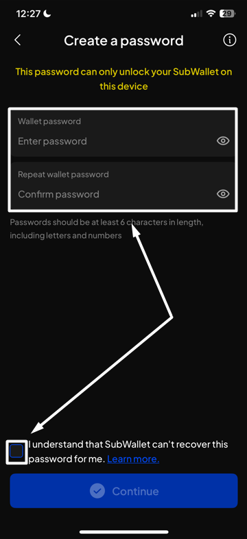

# Import by QR code

### If you are currently using SubWallet

**Step 1**: On the SubWallet homepage, hit the account name to access the account selection tab.

<figure><figcaption></figcaption></figure>

**Step 2**: In the account selection tab, press the  icon at the bottom of the screen.

<figure><figcaption></figcaption></figure>

**Step 3**: Choose "**Import by QR code**" as the chosen method to import your account.

<figure><figcaption></figcaption></figure>

**Step 4**: Press the "**Scan QR code**" button.

<figure><figcaption></figcaption></figure>

If you haven't granted camera access to SubWallet yet

In this case, once you hit the button, your device will show the following message:

Click "**Go to Settings**" to open your phone's settings.&#x20;

On the settings screen, switch the toggle next to "**Camera**" to allow the camera access to the app.

**Step 5**: Present your QR code and scan it with SubWallet using your device's camera, or upload an image containing this QR code using the "**Upload from photos**" option.

<figure><figcaption></figcaption></figure>

**Step 6**: If SubWallet detects an account from the QR code, a popup will appear, asking you to enter the name of your account. Once done, click "**Confirm**".

<figure><figcaption></figcaption></figure> <figure><figcaption></figcaption></figure>

You've successfully imported your account!

<figure><figcaption></figcaption></figure>

#### **If you have not had any accounts with SubWallet**

**Step 1**: Open the SubWallet app. On the welcome screen, choose "**Import an account**".

<figure><figcaption></figcaption></figure>

**Step 2**: Choose "**Import from seed phrase**" to import account.

<figure><figcaption></figcaption></figure>

**Step 3:** Create a master password with at least 6 characters and tick "**I understand that SubWallet can't recover the password**". Once done, hit "**Continue**".

<figure><figcaption></figcaption></figure> <figure><figcaption></figcaption></figure>


SubWallet is non-custodial, so you will be the only person who knows your password; we can't help you restore it once it is lost. Make sure that your password is well-kept.


Once you create a master password, you can follow the importing procedure provided in [If you are currently using SubWallet](https://app.gitbook.com/o/CyPU0v2iA12ILmupTKub/s/-Lh39Kwxa1xxZM9WX_Bs/~/changes/708/mobile-app-user-guide/account-management/import-accounts/import-by-qr-code#if-you-are-currently-using-subwallet), starting from **Step 3.**
