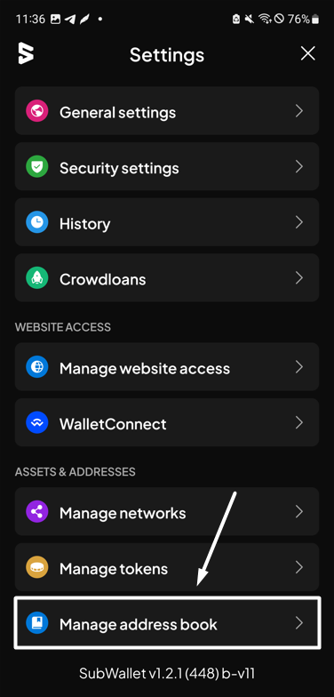
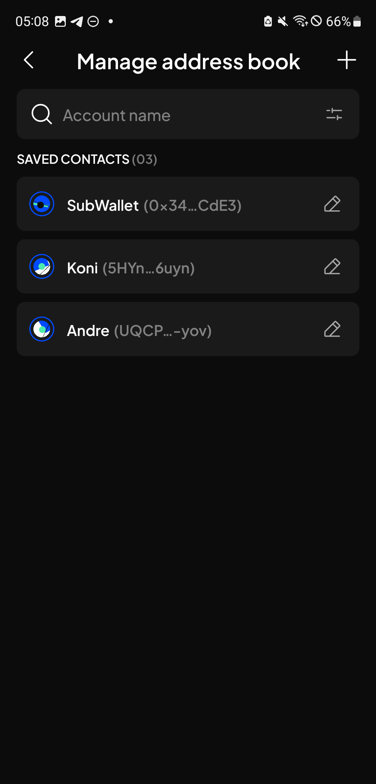

# Manage address book

**Step 1**: On the SubWallet homepage, tap the list item at the top left corner to get to the Settings section.

<figure><figcaption></figcaption></figure>

**Step 2**: In the Settings section, select "**Manage address book**".

<figure><figcaption></figcaption></figure>

You will be directed to the address list.

<figure><figcaption></figcaption></figure>

Depending on what fits your needs, choose the appropriate tab below.



**Step 3**: Hit the "**+**" button at the top right corner to add a new address book.

<figure><figcaption></figcaption></figure>

**Step 4**: Enter the contact name and address in the corresponding fields. Once done, hit "**Add contact**" to proceed.


Currently, SubWallet supports 3 address types:

* Polkadot (Substrate) address
* Ethereum (EVM) address
* TON address


<figure><figcaption></figcaption></figure> <figure><figcaption></figcaption></figure>

**Step 5**: Your contact has been saved to the address book!

This contact will instantly be available when you transfer tokens or NFTs.

<figure><figcaption></figcaption></figure>




SubWallet allows editing the contact name **only**.


**Step 3**: Select the contact you wish to edit by hitting the  icon next to its name.

<figure><figcaption></figcaption></figure>

**Step 4**: Enter a new contact name, then hit "**Save**" for SubWallet to save the new name.

<figure><figcaption></figcaption></figure> <figure><figcaption></figcaption></figure>

**Step 5**: You have successfully renamed your contact!

<figure><figcaption></figcaption></figure>



**Step 3**: Choose the contact you wish to remove by hitting the icon next to its name.

<figure><figcaption></figcaption></figure>

**Step 4**: Tap the bin item at the bottom left corner.

<figure><figcaption></figcaption></figure>

**Step 5**: A confirmation screen will appear. Hit "**Delete**" to confirm the removal.

<figure><figcaption></figcaption></figure>

**Step 6**: You have successfully removed a contact from the address list!

<figure><figcaption></figcaption></figure>



