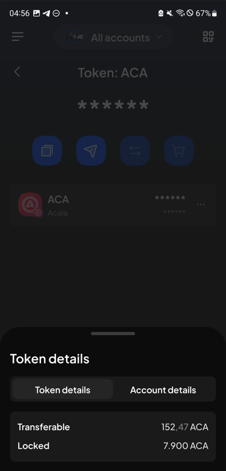

# Show/hide balances


SubWallet will hide your balances by default when you first use the extension.


You can choose to either unveil your balances to get a clear view of your assets or keep them private from prying eyes, safeguarding your funds from public exposure.

### To show your balances 

**Step 1**: On the SubWallet homepage, tap the hide icon to unveil your balance.

<figure><figcaption></figcaption></figure>

**Step 2**: Your balances will be displayed once you tap.

<figure><figcaption></figcaption></figure>

### To hide your balances 

**Step 1**: On the SubWallet homepage, tap the eye symbol.

<figure><figcaption></figcaption></figure>

**Step 2**: All information regarding your balances will be hidden once you tap.

<figure><figcaption></figcaption></figure>


While hidden, you can still view your balances individually by tapping on the token you want to unveil.


