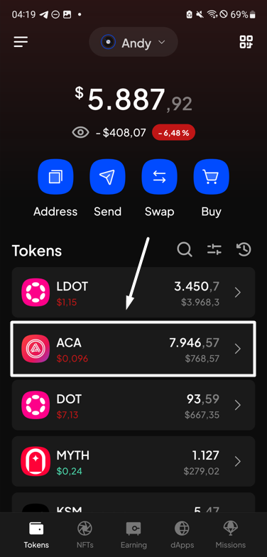
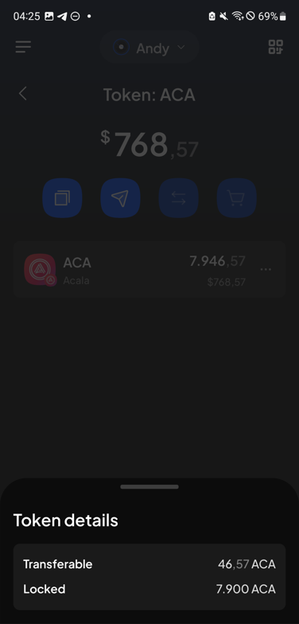

# View token balances

### Understand balance types 

Different balance types dictate whether your balance can be used for transfers, to pay fees, or must remain frozen and unused due to an on-chain requirement.

In SubWallet, with each token, there are 2 types of balances depending on the account activity:

* **Transferable**: The transferable balance indicates the number of free tokens available to be transferred.
* **Locked**: The locked balance indicates the number of frozen tokens unavailable to be transferred.

### View your token's balance 

**Step 1**: On the SubWallet homepage, select the token you want to view its balance.

_In this example, we want to view ACA's balance on the Acala network. Tap "ACA" to proceed._

<figure><figcaption></figcaption></figure>

**Step 2**: In the Token screen, click ACA on the Acala network to get to the Token details screen. You'll see detailed information about your token balances.

<figure><figcaption></figcaption></figure> <figure><figcaption></figcaption></figure>


If you are in the "**All accounts**" mode, you can also click the "**Account details**" tab to see detailed token balance information on each account.



### Show/hide zero balances 

If you like keeping your wallet tidy by hiding all the tokens with zero balance, this feature is made for you.


This feature is enabled by default when you first use the wallet, but you can turn it off to fit your needs.


**Step 1**: On the SubWallet homepage, tap the fader icon to get to the Customize asset display screen.

<figure><figcaption></figcaption></figure>

**Step 2**: Turn on/off the "**Show zero balance**" toggle to hide/show all the tokens with zero balances.

_In this example, we want to enable the toggle._

<figure><figcaption></figcaption></figure> <figure><figcaption></figcaption></figure>


You can enable/disable the toggle back at any time.


**Step 3**: Voila! Now, the wallet will only display tokens that have a balance.

<figure><figcaption></figcaption></figure>
