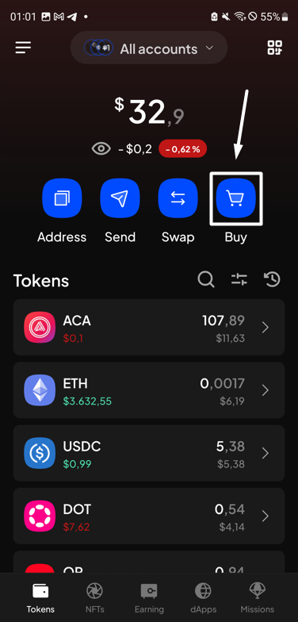
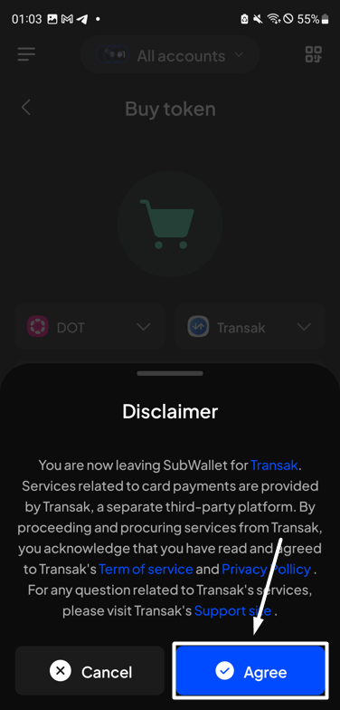
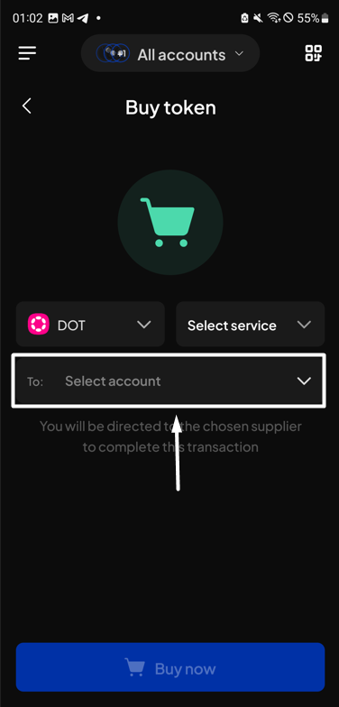
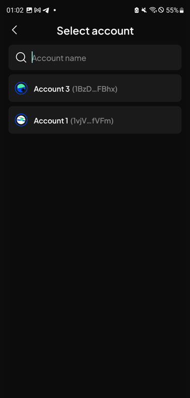

# Buy crypto from fiat money


SubWallet has partnered with Transak, Banxa, and Coinbase Pay to provide you with on-ramp services.


### If you are in Single-account mode 

**Step 1**: Open the SubWallet app. On the homepage, hit the "**Buy**" icon.

<figure><figcaption></figcaption></figure>

**Step 2**: Select the token and the corresponding supplier you want to buy from. There will be a list for you to choose from. Once done, hit "**Buy now**".

**Step 3:** Read the disclaimer carefully, then tap "**Agree**" to proceed. SubWallet will redirect you to your chosen supplier's website so you can continue and complete the transaction.

<figure><figcaption></figcaption></figure>

### If you are in "All accounts" mode 

In "**All accounts**" mode, most steps are identical to the "Single-account mode". The only additional step is to select the account for which you want to buy tokens.

<figure><figcaption></figcaption></figure> <figure><figcaption></figcaption></figure>

