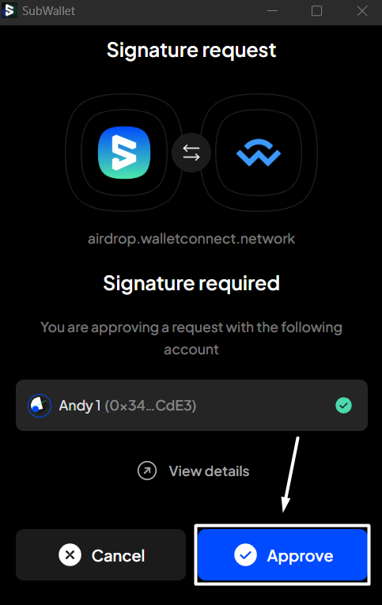

# Connect/disconnect dApp via WalletConnect


WalletConnect is a protocol that securely connects users' cryptocurrency wallets with dApps, enabling convenient and secure interaction between the two. It eliminates the need for manual entry of wallet information and enhances security in transactions and account access.


## Connect dApp with WalletConnect

### Connect to dApp in-app


If you want to connect dApp via WalletConnect directly from your device, follow the instructions below.


**Step 1**: On the SubWallet homepage, press the "dApps" tab at the bottom of the screen.

<figure><figcaption></figcaption></figure>

**Step 2**: Search for the dApp you want to access by typing on the search bar or selecting a dApp in the Recommended section.

_In this example, we are connecting to Hydration DEX._

<figure><figcaption></figcaption></figure> <figure><figcaption></figcaption></figure>

**Step 3**: After successfully accessing the dApp, find the Connect button to connect your account(s).


Depending on each dApp, you will see different buttons, but they are mostly labeled "**Connect**" or "**Connect Wallet**".


_In this example, as we connect to Hydration DEX, the "**Connect Wallet**" button will be at the top right of the screen._

<figure><figcaption></figcaption></figure>

**Step 4:** Choose "**WalletConnect**" as your connect method.

<figure><figcaption></figcaption></figure>

**Step 5:** The WalletConnect modal popup will appear. Choose "SubWallet" as your desired wallet to connect.

<figure><figcaption></figcaption></figure>


If you can't find the SubWallet option, tap "View all" and type SubWallet in the search bar.


Once done, another popup will appear. Choose the account(s) you want to connect to and hit "**Approve**".

<figure><figcaption></figcaption></figure> <figure><figcaption></figcaption></figure>


Some dApps may require verifying your account ownership before you connect to them.&#x20;

In such instances, another popup will appear. Choose the "**Approve**" option to complete the process.



**Step 6**: You have successfully connected your account(s) to a dApp via WalletConnect!&#x20;

<figure><figcaption></figcaption></figure> <figure><figcaption></figcaption></figure>

### Connect to dApp by scanning the QR code


If you want to connect to dApp on another device, follow the instructions below.


**Step 1**: Open the dApp on another device.

* If the device is a desktop/PC, check out this [guide](../../extension-user-guide/connect-dapps-and-manage-website-access/connect-dapp-with-walletconnect.md)
* If the device is mobile, follow the instructions [above](https://app.gitbook.com/o/CyPU0v2iA12ILmupTKub/s/-Lh39Kwxa1xxZM9WX_Bs/~/changes/714/mobile-app-user-guide/connect-dapps-and-manage-website-access/connect-disconnect-dapp-via-walletconnect#connect-to-dapp-in-app). In step 5, press the QR icon at the upper right of the popup.

Once the QR code from WalletConnect is displayed, you can scan it from your device. Choose one of the following methods that suited best for you:



**Step 2**: From your device, open the SubWallet app. On the homepage, tap the QR icon at the top right corner.

<figure><figcaption></figcaption></figure>

**Step 3**: Connect to dApp by pointing your camera towards the QR code to scan.

<figure><figcaption></figcaption></figure>

**Step 4**: A popup will appear. Choose the account(s) you want to connect to and hit "**Approve**".

<figure><figcaption></figcaption></figure> <figure><figcaption></figcaption></figure>

**Step 5**: You have successfully connected your account(s) to a dApp via WalletConnect!

<figure><figcaption></figcaption></figure>



Step 2: From your device, open the SubWallet app. On the homepage, tap the  icon at the top left corner of the screen to get to the Settings section.

<figure><figcaption></figcaption></figure>

**Step 3:** In the Settings screen, select "**WalletConnect**".

<figure><figcaption></figcaption></figure>

**Step 4**: Connect to dApp by pointing your camera towards the QR code to scan.

<figure><figcaption></figcaption></figure>


If you see a list of dApps/sites connected to SubWallet in the WalletConnect screen, hit "**New connection**" to connect to your dApp.



**Step 5**: A popup will appear. Choose the account(s) you want to connect to and hit "**Approve**".

<figure><figcaption></figcaption></figure> <figure><figcaption></figcaption></figure>

**Step 6**: You have successfully connected your account(s) to a dApp via WalletConnect!&#x20;

<figure><figcaption></figcaption></figure>



## Disconnect dApp with WalletConnect

**Step 1**: On the SubWallet homepage, tap the  icon at the top left corner of the screen to get to the Settings section.

<figure><figcaption></figcaption></figure>

**Step 2**: In the Settings screen, select "**WalletConnect**".

<figure><figcaption></figcaption></figure>

**Step 3**: You will see a list of websites connected to SubWallet and the corresponding number of accounts connecting. Select the dApp you want to disconnect, then click "**Disconnect**".

<figure><figcaption></figcaption></figure>

**Step 4**: A popup will appear, asking you to confirm the action. Hit "**Disconnect**" to complete the process.

<figure><figcaption></figcaption></figure>

You have successfully disconnected your account(s) via WalletConnect!&#x20;
