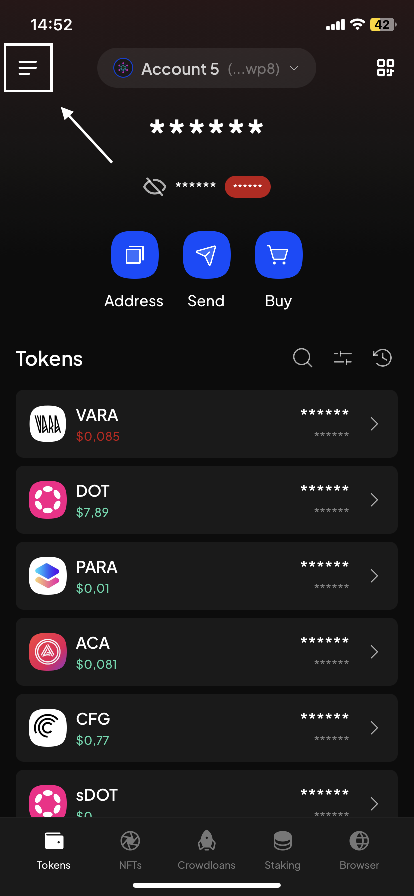
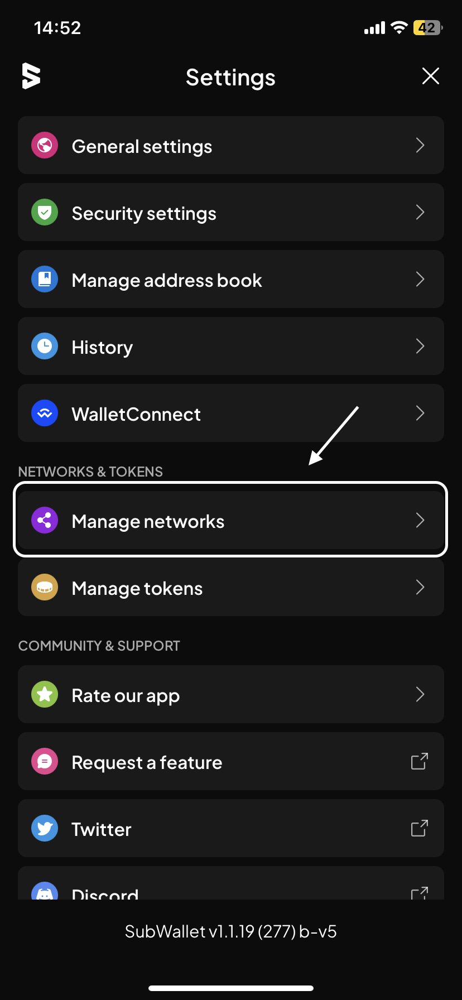
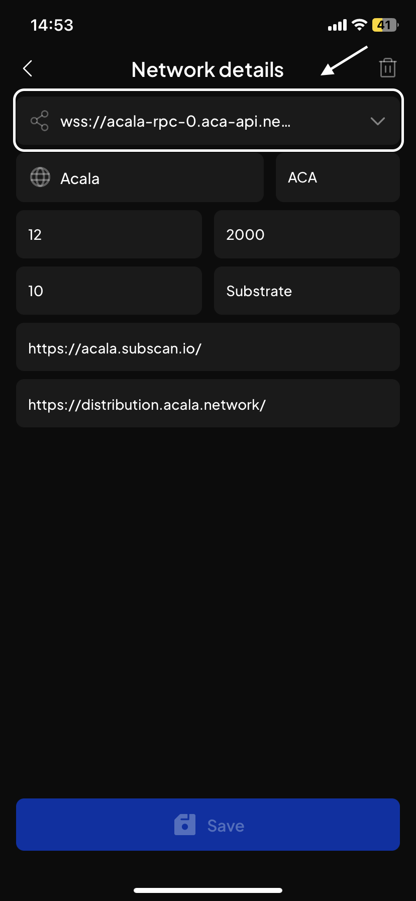
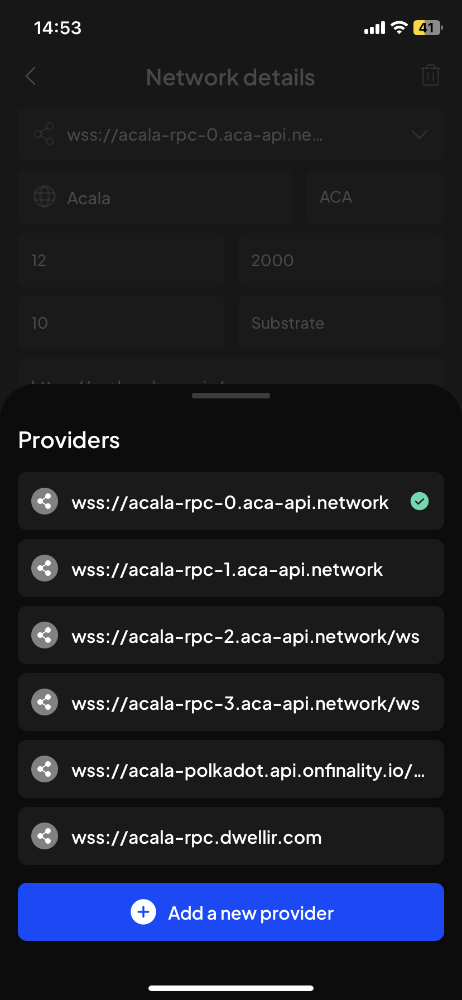
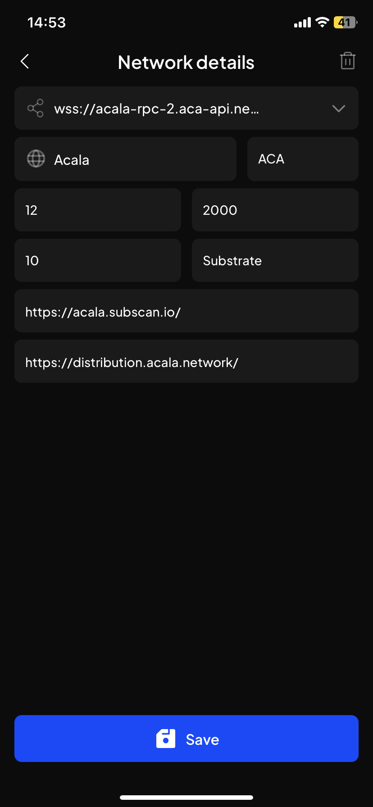

# Customize endpoint/provider

The document will show you how to customize endpoint/provider on SubWallet mobile app.

**Step 1**: Open SubWallet and click on the list item on the upper left corner to get to Settings section.

<figure><figcaption></figcaption></figure>

**Step 2**: In the Settings section, choose "Manage networks".

<figure><figcaption></figcaption></figure>

**Step 3**: Customize your provider by clicking the pencil icon next to the network you want to customize the provider for. In this case we want to change provider for Acala.

<figure><figcaption></figcaption></figure>

**Step 4**: In the Network details section, click on the provider URL.

<figure><figcaption></figcaption></figure>

**Step 5**: A modal would appear. Choose the provider you want to use among the list.

<figure><figcaption></figcaption></figure>


If you want to use a provider outside of our suggested list, please click "Add new provider". The following screen would appear:

Please enter the provider's URL and click "Save". If you need any further assistance, don't hesitate to contact us via [Discord](https://discord.gg/CvVewvApry)  and [Telegram](https://t.me/subwallet).


**Step 6**: After choosing, you will be directed back to the Network details screen. Click "Save" to save your changes.

<figure><figcaption></figcaption></figure>


Several networks are experiencing endpoint instability at the moment. You might need to change endpoints/providers one by one in this case to see which one works. If no endpoints work, please try again later.

