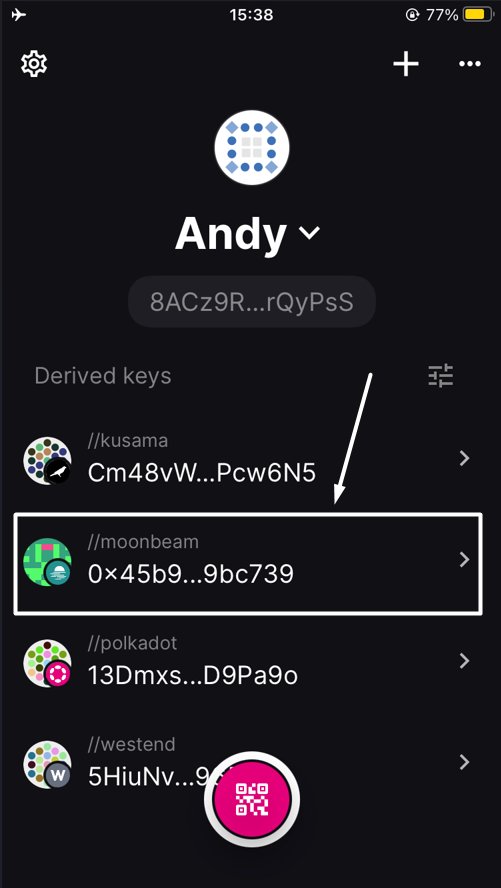
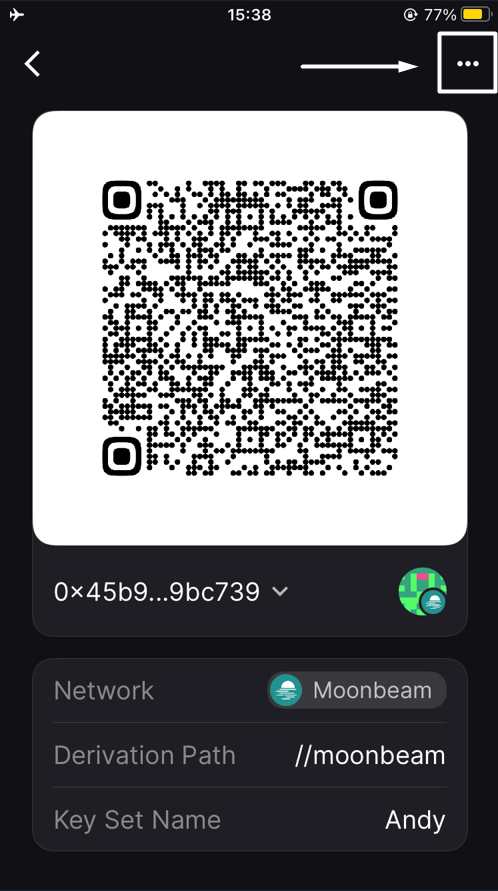
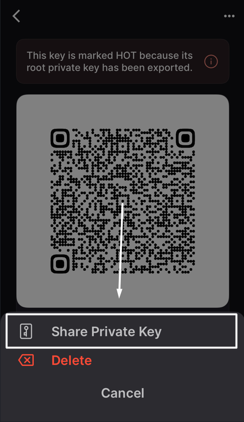
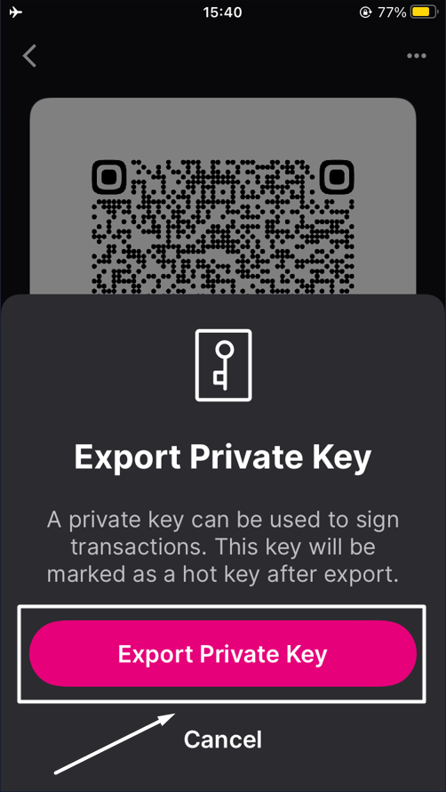

# FAQs

## Can I use the SubWallet mobile app on iOS 17?

Yes, but due to iOS 17’s instability, you may run into some problems. SubWallet has recorded several cases where users reported losing app data after updating to iOS 17.1, so we recommend either not updating yet or **backing up your data** before updating to iOS 17 (see instructions below). We are working hard to resolve this problem. For updated information, please join our [Telegram](https://t.me/subwallet) or [Discord](https://discord.gg/vPCN4vdB8v).


[export-and-backup-accounts.md](account-management/export-and-backup-accounts.md)


<mark style="color:yellow;">**Nov 28, 2023 update**</mark>: For user security and app performance, SubWallet, like many iOS apps, has been using the Apple webkit to store app data locally on the device. Therefore, app data loss can happen due to the iOS 17 webkit's instability. This problem has been reported by multiple applications running on iOS and using Apple webkit for local data storage. \
We have implemented hotfixes in v1.1.11 (241) to lower the risk of losing app data, and we will continue to work on a drastic solution in the coming days.

<mark style="color:yellow;">**Nov 30, 2023 update**</mark>: The issue has been fixed in v1.1.12 (242). All users are recommended to update to the latest version.

## I can't sign transactions via Polkadot Vault on EVM networks.

This is due to the latest update of the Polkadot Vault app, in which Polkadot Vault no longer supports signing transactions for the EVM networks (Moonbeam, Moonriver, Moonbase).

If you have assets on these networks on Polkadot Vault, please follow the steps below to transfer them out of your Polkadot Vault account:


In this example, we want to transfer GLMR on Moonbeam out of the account using an iPhone.


**Step 1**: On the homepage, click on the Moonbeam Key Set.

<figure><figcaption></figcaption></figure>

**Step 2**: Click on the 3-dot icon at the top right of the screen and click the "**Share Private Key**" option.

<figure><figcaption></figcaption></figure>

<figure><figcaption></figcaption></figure>

**Step 3**: Enter your passcode to authorize the action, then choose the "**Export Private Key**" button.

<figure><figcaption></figcaption></figure>

<figure><figcaption></figcaption></figure>

The "**Export Private Key**" screen will pop up with the QR code of your private key. Screenshot and keep it in a safe place.

<figure><figcaption></figcaption></figure>

**Step 4**: Open the SubWallet extension. On the SubWallet homepage, click on the account name at the top left of the screen to get to the account list.

<figure><figcaption></figcaption></figure>

**Step 5**: Click the "**Import**" icon at the bottom of the account list.

<figure><figcaption></figcaption></figure>

**Step 6**: Choose the "**Import by QR code**" option.

<figure><figcaption></figcaption></figure>

**Step 7**: Click the "**Scan the QR code**" button.

<figure><figcaption></figcaption></figure>

**Step 8**: If you have not previously granted camera access to SubWallet, please click "**OK**" to allow.

Then, choose the "**Upload from photos**" option and select the screenshot you have taken in **Step 3**.

<figure><figcaption></figcaption></figure>

**Step 9**: After successfully importing the account, you will be directed to the homepage. You can now transfer your GLMR to another account using the guide [here](https://docs.subwallet.app/main/mobile-app-user-guide/receive-and-transfer-assets/transfer-tokens).
