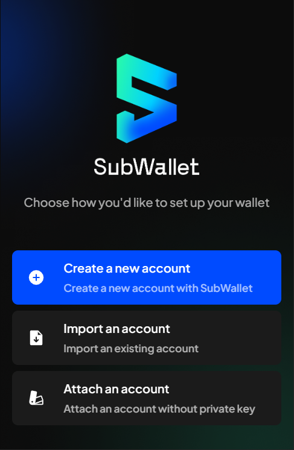

# Create, apply, change and what to do when forgot password

At the start of your journey with us, we always ask you to create a password (such as when you [create a new account](../account-management/create-a-new-account-with-new-seed-phrase.md) or [import and restore an existing account](../account-management/import-restore-an-account.md)).&#x20;

If you have been using the current version of the SubWallet extension wallet, when updating to the new official version, SubWallet will ask you to create and apply a master password to your existing accounts.&#x20;

<figure><figcaption></figcaption></figure>

If you have already used SubWallet before and are migrating to the new version, we would ask you to create and apply a password to your existing accounts. Please read the corresponding guide to see if it correctly describes your situation.

Once applied, you can also [change your master password](create-apply-change-and-what-to-do-when-forgot-password.md#change-master-password) if you so wish. Please note that you would need your current master password to confirm the change.&#x20;


In order to change your password, you would need to remember your old password. This function cannot help you if you forget your password and want to restore it.&#x20;

If you lose your password, you would need to [import the account](../account-management/import-restore-an-account.md) again with a seedphrase, private key, or QR code, and then set up a new password.&#x20;


## Apply master password

After creating the master password, we would ask you to apply the newly created master password to all your accounts.&#x20;


You would need your old password for each account to confirm the change.&#x20;


**Step 1**: Click **Apply master password** to continue.

.png>)

**Step 2**: Enter your old password for each and every account you are managing with SubWallet and click **Next**.

In this example, we are managing 04 accounts with SubWallet.

.png>) .png>) .png>) .png>)

**Step 3**: Your master password has been successfully applied! Click **Finish** to go to the Home screen.&#x20;

.png>)

## Change master password


Please note that SubWallet is non-custodial, so you would be the only person who knows your password; we cannot help you restore your password once it is lost.&#x20;

Please make sure that your password is well-kept. \
In order to change your password, you would need to remember your old password. This function cannot help you if you forget your password and want to restore it.&#x20;


**Step 1**: Open SubWallet and choose the list item on the top left corner to get to the Settings section.

.png>)

**Step 2**: Choose **Security settings**, then click **Change password**.

.png>) .png>)

**Step 3**: Enter your password and click **Finish**.&#x20;

You would need your old password to confirm the change.&#x20;

.png>)\

## Forgot password


If you forgot your account password, don't worry! You can continue the process by re-importing your account to the app. Simply ensure you have your seed phrase/JS backup file/private key/QR backup key, and you can easily regain access to your account.


**Step 1**: At the welcome page, click **Forgot password?**.

<figure><figcaption></figcaption></figure>

**Step 2:** Here, there will be 2 options provided:

* Reset account
* Erase all

Choose the option you want to apply:

<figure><figcaption></figcaption></figure>

#### **With the "Reset account" option**

Once you have clicked this option, all the accounts you have imported/attached will be removed. You will be directed to the Welcome screen.

<figure><figcaption></figcaption></figure>


This action will reset your account to the initial settings when you first use the app.&#x20;

The networks and tokens you have manually turned on/added will be automatically turned off/deleted. You will have to turn on or add your networks/tokens manually.


#### With the "Erase all" option

Like the "Reset account" option, all the accounts you have imported/attached will be removed, and you will be directed to the Welcome screen. But there are some differences!


This action will **reset all** the information associated with your account, including your:

* Balances & NFTs
* Staking
* Crowdloans
* Transactions (History)
* List custom network and token
* Chain state, asset state
* Setting: PIN code, Security, Language, Website Access...
* Manage address book.


**Step 3:** In this step, you will re-import your forgotten account using your seed phrase/JS backup file/private key/QR backup key. For instructions on how to import an account, click [here](../account-management/import-restore-an-account.md).


Please note that SubWallet will lock automatically after 15 minutes of inactive or if you exit the app.&#x20;

