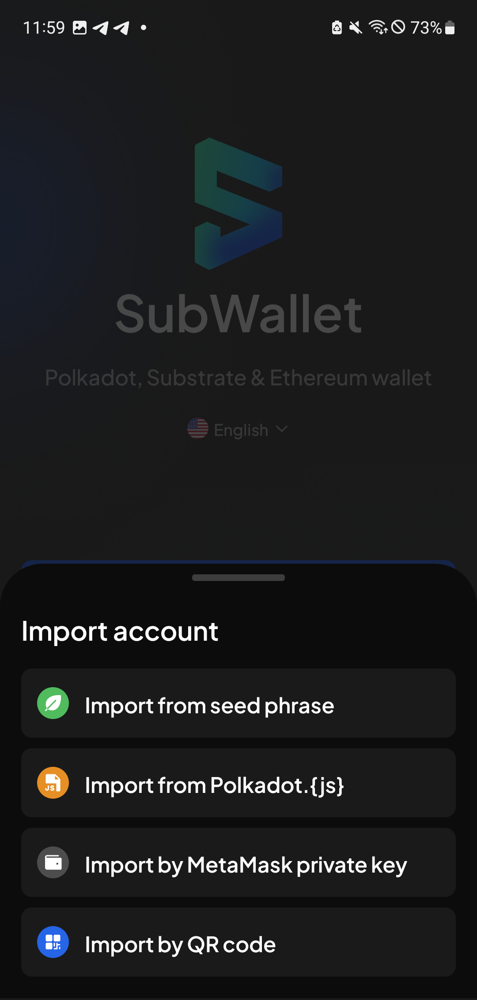
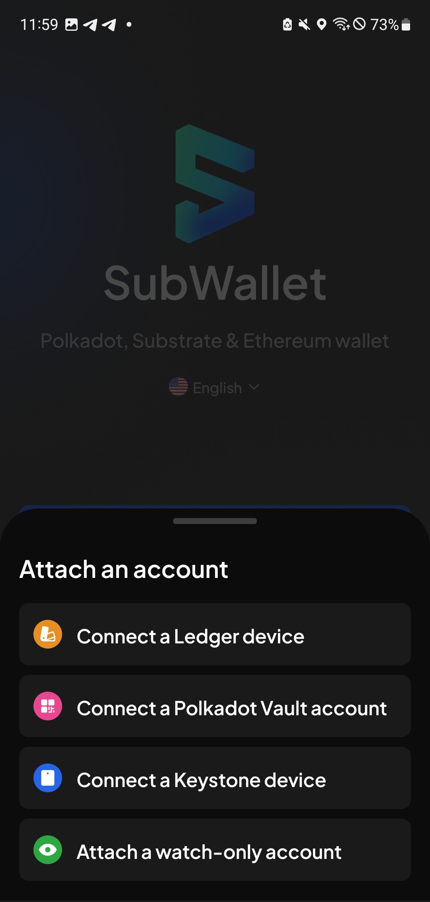

# Create your master password


At the start of your journey with us, we always ask you to create a master password (such as when you create a new account or import an existing account).


**Step 1**: After installing SubWallet, open the app. On the Welcome screen, select your preferred option.

<figure><figcaption></figcaption></figure>


If you choose "**Import an account**" or "**Attach an account**", you will need to select your preferred option.



**Step 2:** Enter a strong password with at least 6 characters and hit the "**I understand that SubWallet can't recover the password for me**" box.


The password should contain numbers & letters.


<figure><figcaption></figcaption></figure>

Once done, hit "**Continue**".

<figure><figcaption></figcaption></figure>

You've successfully created a master password in SubWallet! Now, you have the power to manage multiple accounts with just one master password effortlessly.


Depending on the option you chose in Step 1, read the corresponding guide after creating a master password to complete the setup:

* If you chose "**Create a new account**", read this guide.
* If you chose "**Import an account**", read this guide.

