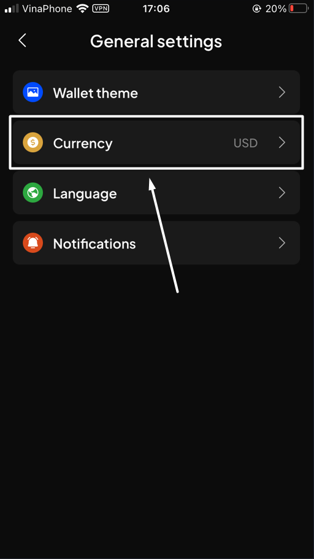
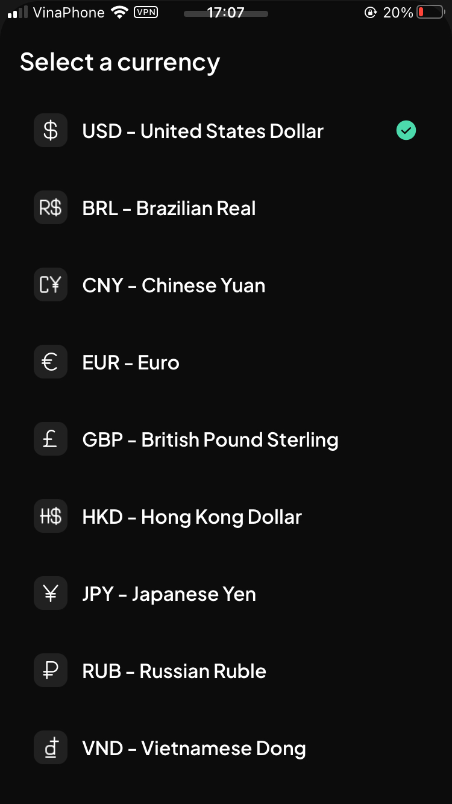
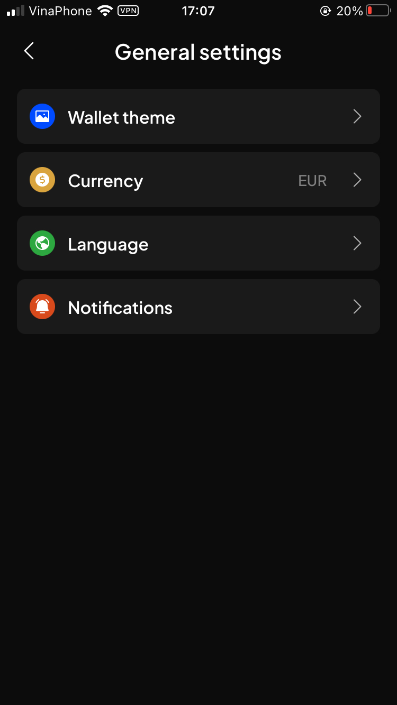
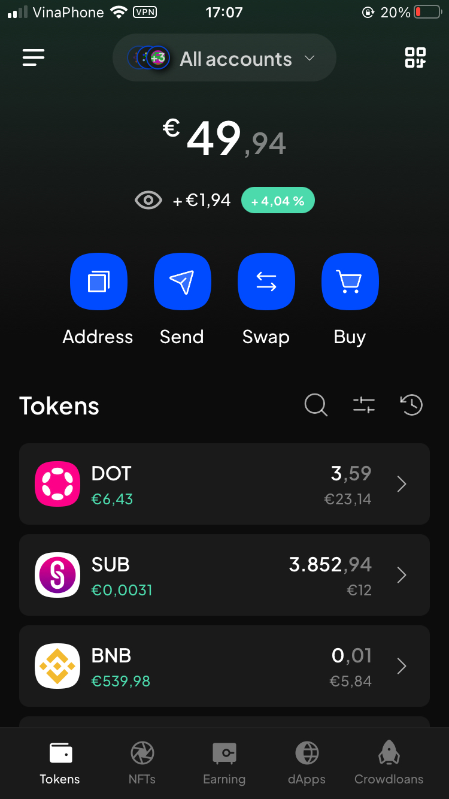

# Customize currency display


We understand that everyone comes from diverse backgrounds and may use a variety of currencies for their transactions. Therefore, we have made it easy for you to track your balance in different currencies.


### Supported currencies

Currently, SubWallet supports 9 fiat currencies, those include:

* USD - United States Dollar
* BRL - Brazilian Real
* CNY - Chinese Yuan
* EUR - Euro
* GBP - British Pound Sterling
* HKD - Hong Kong Dollar
* JPY - Japanese Yen
* RUB - Russian Ruble
* VND - Vietnamese Dong

### Customize your currency preferences

**Step 1:** On the SubWallet homepage, click on the list item at the top left corner to get to the Settings section.

<figure><figcaption></figcaption></figure>

**Step 2:** In the Settings section, click “General settings”.&#x20;

<figure><figcaption></figcaption></figure>

After that, choose the “Currency” option.

<figure><figcaption></figcaption></figure>

**Step 3:** In the Currency list, select your preferred currency.

<figure><figcaption></figcaption></figure>

In this example, we chose "EUR - Euro" as the displayed currency. Once done, you will be redirected back to the General settings screen.

<figure><figcaption></figcaption></figure>

**Step 4:** You are done! Please return to the homepage to see your balance in your chosen currency.

<figure><figcaption></figcaption></figure>


The next time you open the app, your portfolio balance will be displayed with your chosen currency.

