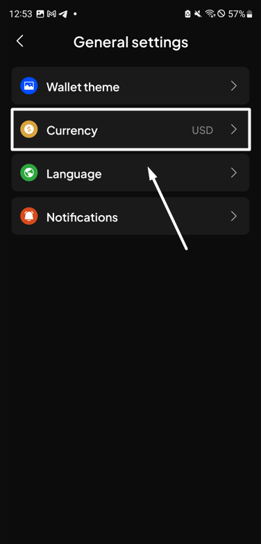
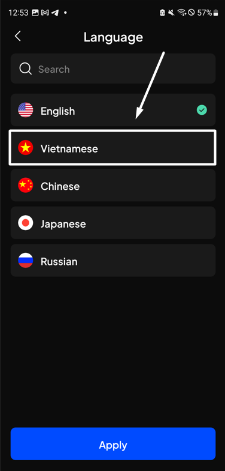
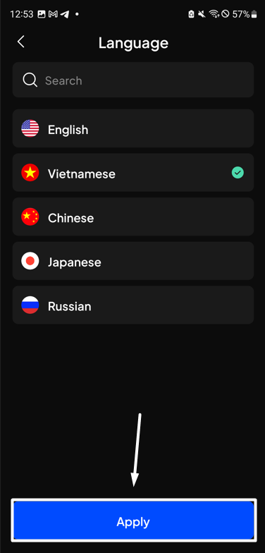

# Customize language display

### Supported languages 

At SubWallet, diversity and accessibility are core to our mission. We are committed to supporting a global community; therefore, we have designed the SubWallet interface to be accessible in various languages.

Currently, our interface is available in the following languages:

* **English**
* **Japanese (日本語)**
* **Chinese (汉语)**
* **Russian (Русский)**
* **Vietnamese (Tiếng Việt)**


More languages will be supported in the future. Stay tuned!


### **Customize language display** 

**Step 1**: On the SubWallet homepage, tap the list item at the top left corner to get to the Settings section.

<figure><figcaption></figcaption></figure>

**Step 2**: In the Settings section, select "**General settings**".

<figure><figcaption></figcaption></figure>

Next, choose "**Language**" to view supported languages.

<figure><figcaption></figcaption></figure>

**Step 3**: Select your preferred language from the list. Once selected, hit "**Apply**" to change the language you want to use.

<figure><figcaption></figcaption></figure> <figure><figcaption></figcaption></figure>

Get ready to explore new horizons and make your journey smooth and enjoyable with SubWallet, no matter where you are!
