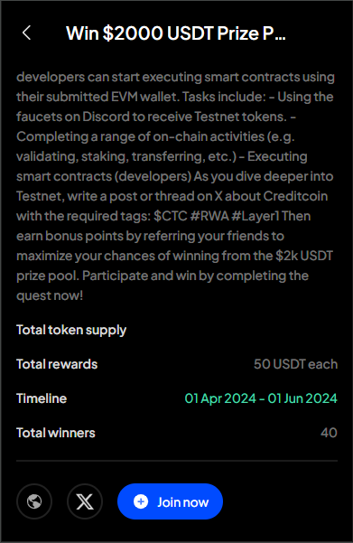

# Mission Pools

This feature allows you to participate in various live and upcoming airdrop campaigns on the Polkadot ecosystem with just a few clicks on SubWallet. Grab yourself a chance to earn amazing rewards that will boost your balance significantly!

**Step 1**: On the SubWallet homepage, click on the list item at the upper left corner to get to the Settings section.

<figure><figcaption></figcaption></figure>

**Step 2**: In the Settings section, choose “Mission Pools”.

<figure><figcaption></figcaption></figure>

**Step 3**: Select the campaign you want to join from the list.

<figure><figcaption></figcaption></figure>


With each campaign, we provide all the information needed so you can decide whether to participate or not. This includes:

* Campaign name
* Supported network(s) for the campaign
* Status: upcoming, live or archived
* Campaign’s description
* Total token supply
* Total rewards
* Timeline
* Total winners
* : Campaign homepage
* : Campaign Twitter (X) site.



Once you have chosen a campaign, click "Join now".&#x20;

You will be directed to the airdrop campaign site. **Complete all the tasks and quests, and may the odds be ever in your favor!**
