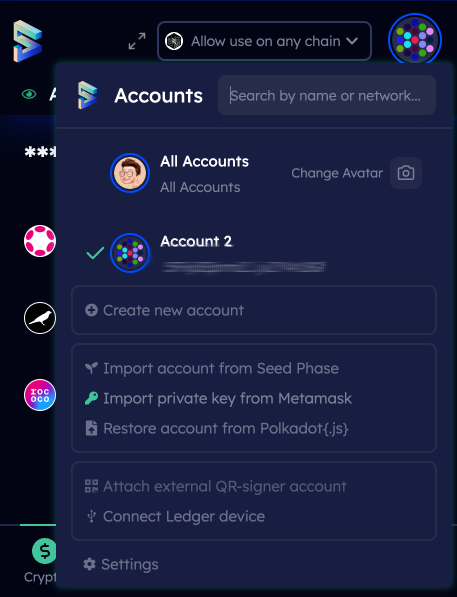

# Import an Account using private key from MetaMask

**Step 1**: Open MetaMask extension. Click on the **Options icon**, then **Account Details**, then hit **Export Private Key**. Enter your password and click on **Next**. Click on **Copy** to copy your **Private key** after it is revealed.

   

**Step 2:** Open the SubWallet extension and click on the round favicon icon in the top right corner. Then hit **Import private key from MetaMask.**

 

**Step 2:** Enter a new password and click **Add the account with the supplied private key.** You have successfully imported a Polkadot EVM wallet (EVM account)!

