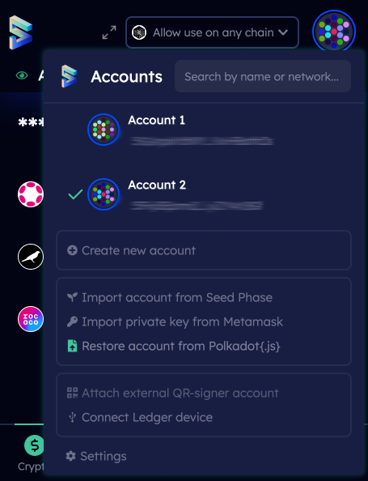

# Restore an Account using JSON backup file

## Export account from Polkadot JS

 

## In a newly installed SubWallet &#x20;

**Step 1:** During installation setup, click **Restore account from backup JSON file**.

 

**Step 2:** Insert your JSON backup file. Enter your password and hit **Restore** (You need to remember the password you have set before for this account).

 (4).jpeg>) .jpeg>)

## In an existing SubWallet &#x20;

Open SubWallet extension and click on the round favicon icon in the top right corner. Then hit **Restore account from Polkadot {.js}** and repeat the steps.

 

 (3).jpeg>) .jpeg>)
