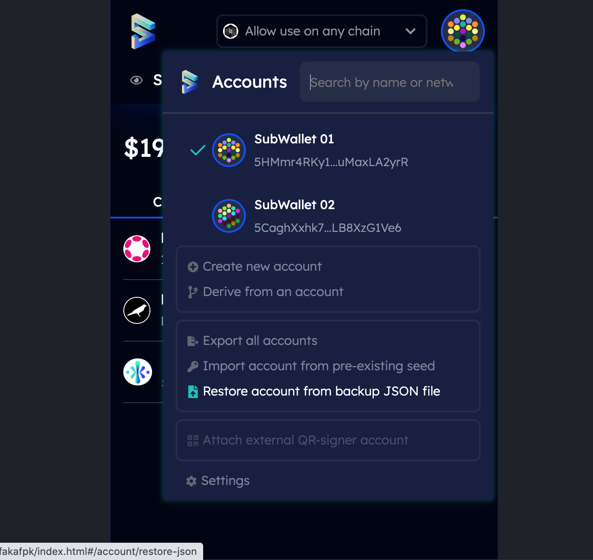

# Manage Crowdloan



**Step 1:** DOYR and choose the projects you want to contribute, enter the amount. Then click **Contribute** button

 .png>)

**Step 2:** Enter your password to sign the transaction. Then you can see your Polkadot and Kusama crowdloan on your SubWallet extension.

.jpeg>) .jpeg>)

