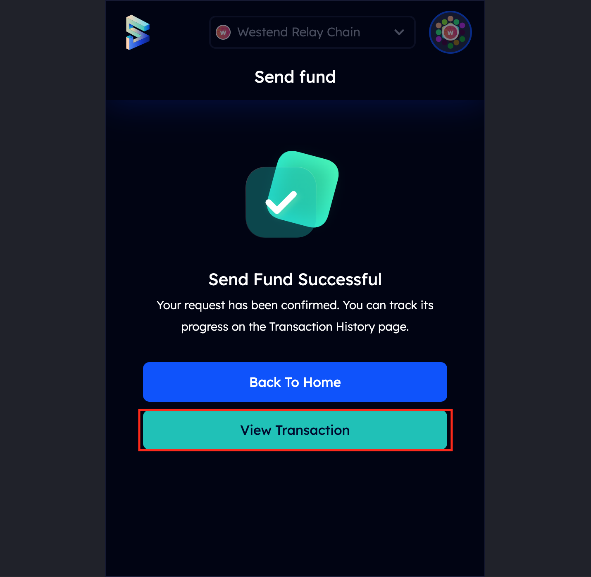
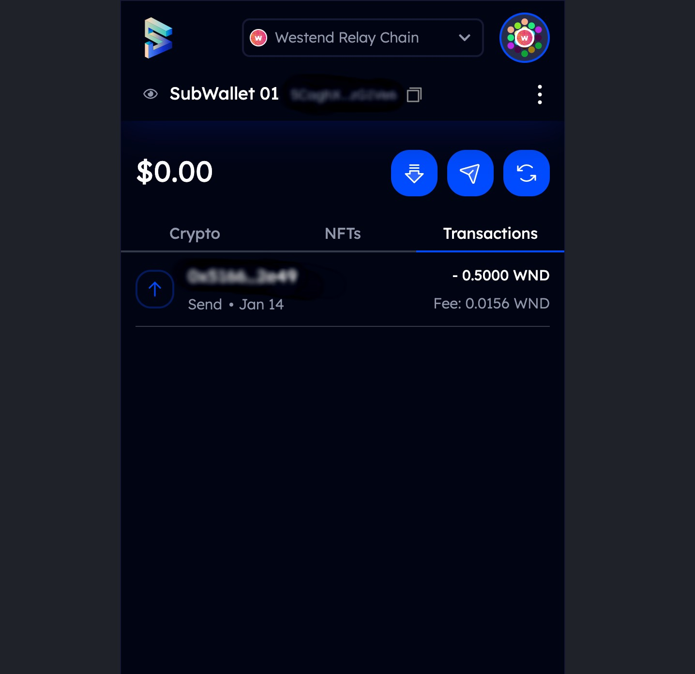
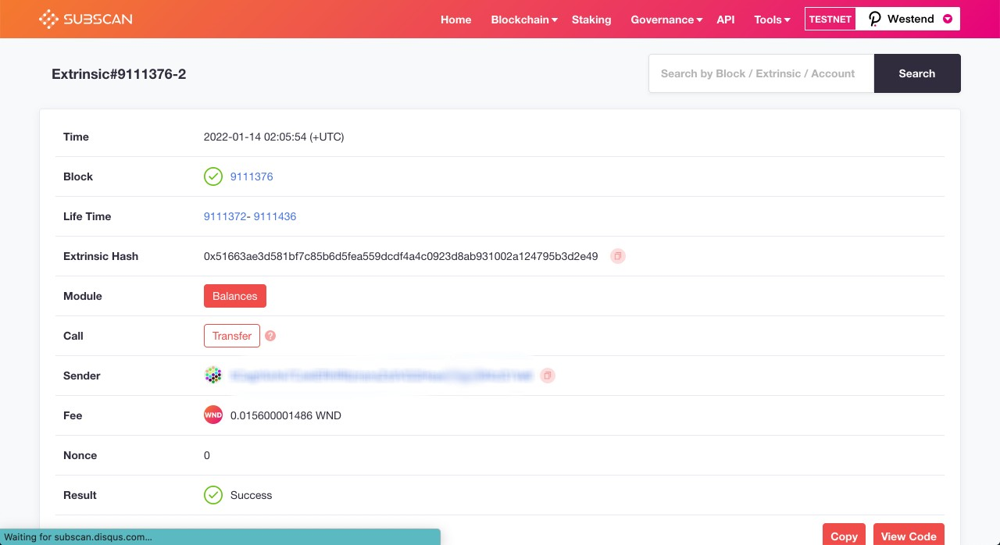
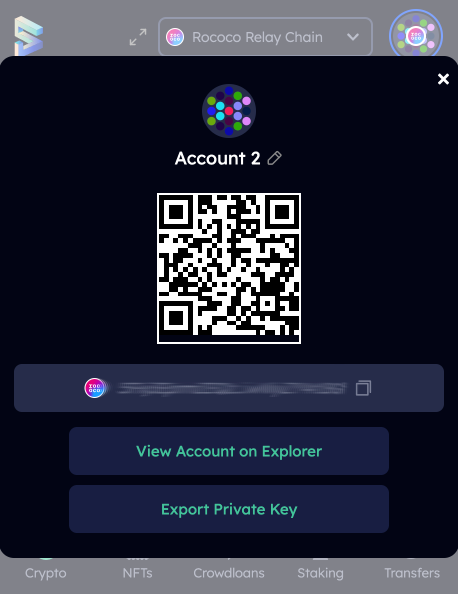

# Transfer and Receive Assets

## **Transfer**&#x20;



**Step 1:** Choose the chain that you want to send assets to and click the **Send** icon. Key in the recipient wallet address and the amount you want to send.&#x20;

 

**Step 2:** Type your password to unlock and send assets. Before clicking **Make Transfer** to proceed with the transaction, it is always better to _double-check_ the recipient address and the amount you are sending.

 

**Step 3:** After your fund has been successfully transferred, the transaction log is available in your wallet. You can also check your transaction on SubScan if you wish to.

 

## **Receive**

**Step 1:** Find your SubWallet address (if you don't know yet) by clicking the **Receive** icon. The long sequence containing both numbers and letters is your wallet address.

 

**Step 2**: Hit the copy button and share your wallet address with your sender.&#x20;


**WARNING:** DO NOT share your mnemonic seed (secret recovery phrase) or JSON backup file with anyone! SubWallet will never ask for your mnemonic seed (secret recovery phrase) or JSON  file, even in a customer support scenario. You can not change or edit your mnemonic seed (secret recovery phrase).

