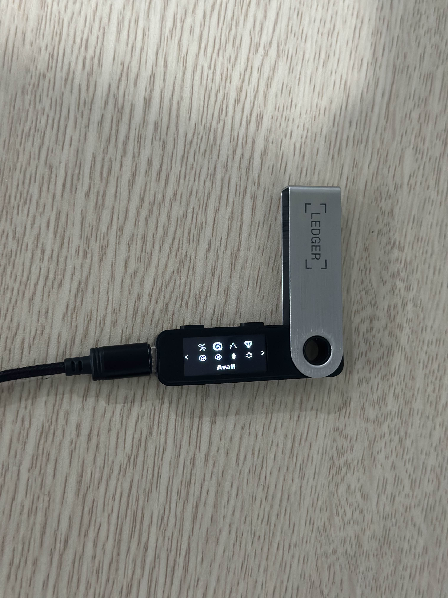
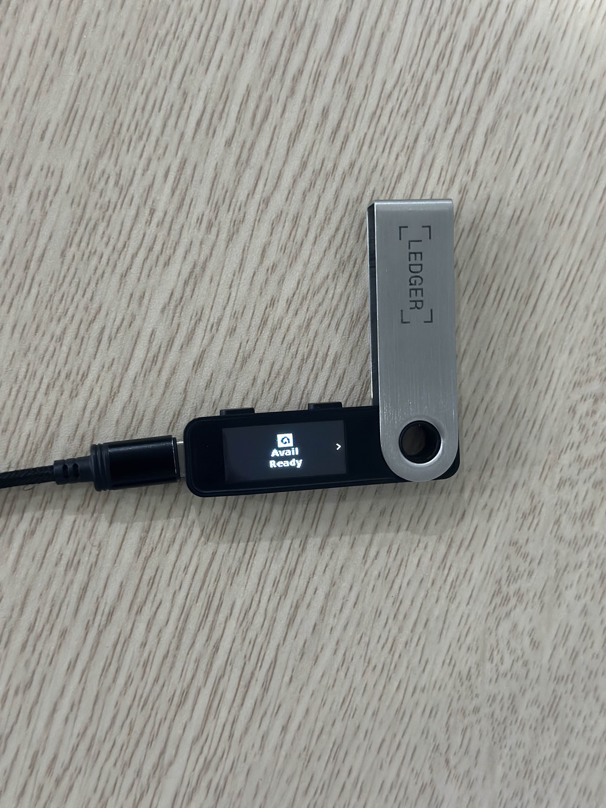

# Connect via network-specific apps


Currently, SubWallet doesn't support Cardano on Ledger.


**Step 1**: Have your Ledger device ready & connected to your computer. Choose the App on your Ledger.

_In this example, we will connect Ledger accounts to SubWallet by choosing the Avail app on the Ledger Nano S Plus device._

<figure><figcaption></figcaption></figure> <figure><figcaption></figcaption></figure>

**Step 2:** On the SubWallet homepage, click on the account name in the upper-right corner to access the account selection tab.

<figure><figcaption></figcaption></figure>

**Step 3**: In the account selection tab, click the  button at the bottom right corner of the screen.

<figure><figcaption></figcaption></figure>

**Step 4**: Choose "**Connect a Ledger device**".

<figure><figcaption></figcaption></figure>

**Step 5**: Select the app corresponding to the current App on your Ledger and click "**Connect**". Your extension will display the following pop-up:

<figure><figcaption></figcaption></figure>

Click on the device name (Nano S Plus in this case) and click "**Connect**".

**Step 6**: After your Ledger has been successfully found by SubWallet, click "**Connect Ledger device**".


Don't forget to turn on the corresponding app on the Ledger device.


<figure><figcaption></figcaption></figure>

**Step 7**: Choose the account(s) you want to use, then click "**Connect Ledger device**".

<figure><figcaption></figcaption></figure>

**Step 8**: Your Ledger account is ready!

If you repeat the action in **Step 2**, you will see your newly connected Ledger Polkadot accounts displayed in the "**Ledger Account**" section.

<figure><figcaption></figcaption></figure>


**Note**: With these apps, their corresponding Ledger accounts can only handle assets like tokens and NFTs within the specific network associated with that account.&#x20;

For example, with Ledger Avail accounts, you will only be able to send, receive, and stake tokens on the Avail network.

