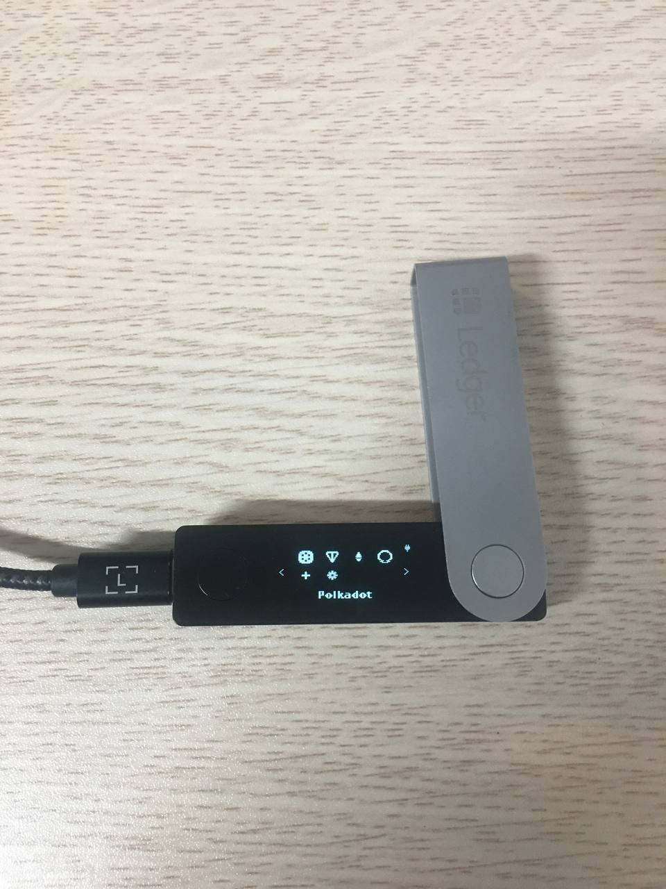
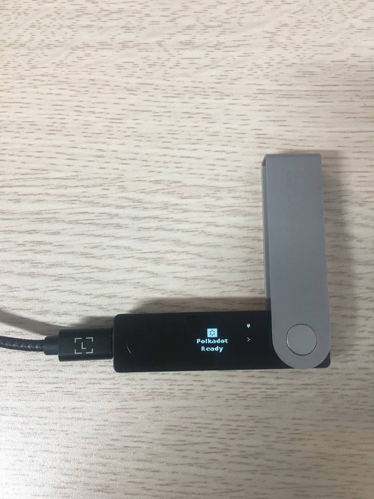

# Connect via the Polkadot app

## Understand the new Polkadot app

On July 1, 2024, the new Polkadot app was released (version 100.0.5). With this new app, you will be able to use a single Ledger account across any Substrate-based network.

To ensure compatibility with the new Polkadot app, all Substrate-based networks need to update their runtime logic. To check if a network has performed this action, visit the [Parachains Metadata dashboard](https://dashboards.data.paritytech.io/metadata.html). If it hasn't, continue using the corresponding Ledger app.


If your Polkadot app is on a version lower than 100.0.5, you're required to update the app in order to continue using and connecting to SubWallet.


## Select the right account type for use when connecting via Polkadot app

Starting from version [100.0.14](https://github.com/LedgerHQ/app-polkadot/releases/tag/v100.0.14), users will be able to connect and perform transactions on Substrate-based networks that use EVM addresses (e.g., _Mythos, Moonbeam, Moonriver_) through the Polkadot app. As these networks use a different signing method from those who fully Substrate-based, you will need to select a different account type to connect.

In particular, after selecting the Polkadot app option, depending on your needs, you will need to choose the account type you want:

<table><thead><tr><th width="172.40008544921875">Account type</th><th width="189.7999267578125" align="center">Default account name</th><th>Compatibility</th></tr></thead><tbody><tr><td>Polkadot account</td><td align="center">Ledger Polkadot</td><td>Manage, receive &#x26; transfer assets on <strong>fully Substrate-based networks</strong> (i.e., networks that use Substrate address format - starting with <strong>5</strong>)</td></tr><tr><td>Ethereum account</td><td align="center">Ledger Polkadot (EVM)</td><td>Manage, receive &#x26; transfer assets on <strong>Substrate-based networks that are EVM-compatible</strong> (i.e., networks that use EVM address format - starting with <strong>0x</strong>)</td></tr></tbody></table>

Unlike Ledger Polkadot accounts, Ledger Polkadot (EVM) accounts only support some tokens & networks. Check out the supported tokens & networks list below to send the correct token to this account type:

| Network                  | Token   |
| ------------------------ | ------- |
| Mythos                   | MYTH    |
| Moonbeam                 | GLMR    |
| Moonriver                | MOVR    |
| Crab2 Parachain          | CRAB    |
|                          | CKTON\* |
| Pangolin                 | PRING   |
|                          | PKTON\* |
| Darwinia 2               | RING    |
|                          | PINK\*  |
|                          | KTON\*  |
| LAOS Network             | LAOS    |
| Atleta Olympic (Testnet) | ATLA    |
| Moonbase Alpha (Testnet) | DEV     |
| Muse Testnet (Testnet)   | MUSE    |

_(\*): Non-native token_

## Connect your accounts via Polkadot app

**Step 1**: Have your Ledger device ready & connected to your computer. Choose the Polkadot App on your Ledger.

<figure><figcaption></figcaption></figure> <figure><figcaption></figcaption></figure>

**Step 2:** On the SubWallet homepage, click on the account name in the upper-right corner to access the account selection tab.

<figure><figcaption></figcaption></figure>

**Step 3**: In the account selection tab, click the  button at the bottom right corner of the screen.

<figure><figcaption></figcaption></figure>

**Step 4**: Choose "**Connect a Ledger device**".

<figure><figcaption></figcaption></figure>

**Step 5**: You will be directed to a new window. As the default app to connect is Polkadot, your extension will display the following pop-up:

<figure><figcaption></figcaption></figure>

Click on the device name (Nano S Plus in this case) and click "**Connect**".

**Step 6**: After connecting, click on the "**Select account type**" field to choose the account type you want to connect.

<figure><figcaption></figcaption></figure>

A popup screen will appear on the right side. Choose the account type you want to connect.&#x20;

_In this example, we will choose "Ethereum account", which will then later be called "Ledger Polkadot (EVM)"._

<figure><figcaption></figcaption></figure>

**Step 7**: After SubWallet has successfully found your Ledger with the chosen account type, click "**Connect Ledger device**".


Don't forget to turn on the corresponding app on the Ledger device.


<figure><figcaption></figcaption></figure>

**Step 8**: Choose the account(s) you want to use, then click "**Connect Ledger device**".

<figure><figcaption></figcaption></figure>

**Step 9**: Your Ledger account is ready!

If you repeat the action in **Step 2**, you will see your newly connected Ledger Polkadot accounts displayed in the "**Ledger Account**" section.

<figure><figcaption></figcaption></figure>
