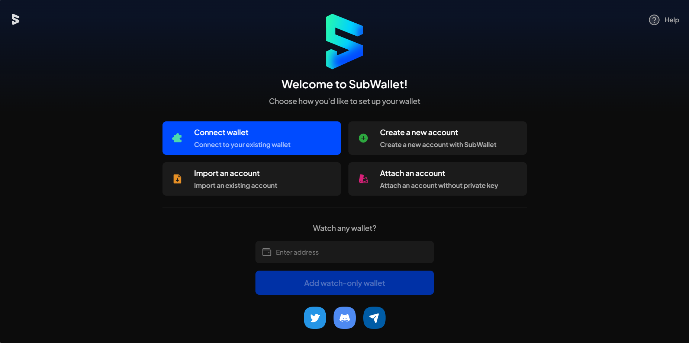

# Forgot password


If you forgot your account password, don't worry! You can still continue the process by re-importing your account to the extension. Simply ensure you have your seed phrase/JS backup file/private key/QR backup code, and you can easily regain access to your account.


**Step 1**: At the welcome page, click "**Don't remember your password?**".

<figure><figcaption></figcaption></figure>

**Step 2:** Here, there will be 2 options provided:

* Reset account
* Erase all

Choose the option you want to apply:

<figure><figcaption></figcaption></figure>

#### **With the "Reset account" option**

Once you have clicked this option, all the accounts you have imported/attached will be removed.&#x20;

You will be directed to the Welcome screen.

<figure><figcaption></figcaption></figure>


This action will reset your account to the initial settings when you first use the app.&#x20;

The networks and tokens you have manually turned on/added will be automatically turned off/deleted. You will have to turn on or add your networks/tokens manually.


#### With the "Erase all" option

Like the "Reset account" option, all the accounts you have imported/attached will be removed, and you will be directed to the Welcome screen. But there are some differences!


This action will **reset all** the information associated with your account, including your:

* Balances & NFTs
* Staking
* Crowdloans
* Transactions (History)
* List custom network and token
* Chain state, asset state
* Setting: PIN code, Security, Language, Website Access...
* Manage address book.


**Step 3:** In this step, choose "Import an account" to re-import your forgotten account using your seed phrase/JSON backup file/private key/QR backup code. For instructions on how to import an account, click [here](../../account-management/import-an-account.md).

<figure><figcaption></figcaption></figure>
