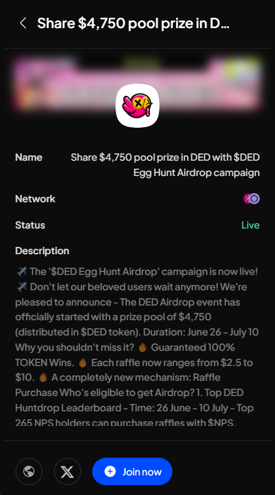

# Mission Pools

This feature allows you to participate in various live and upcoming airdrop campaigns on the Polkadot ecosystem with just a few clicks on SubWallet. Grab yourself a chance to earn amazing rewards that will boost your balance significantly!

**Step 1**: On the SubWallet homepage, click the "**Mission Pools**" tab on the sidebar.

<figure><figcaption></figcaption></figure>

**Step 2**: The list of campaigns will appear. Select the campaign you want to join from the list.

<figure><figcaption></figcaption></figure>


With each campaign, we provide all the information needed so you can decide whether to participate or not. This includes:

* Campaign name
* Supported network(s) for the campaign
* Status: Live or Archived
* Campaign type(s)
* Campaign’s description
* Total rewards
* Timeline
* Total winners
* : Project website
* : Project Twitter (X) page.



Once you have chosen a campaign, click "**Join now**".&#x20;

You will be directed to the airdrop campaign site. **Complete all the tasks and quests, and may the odds be ever in your favor!**
