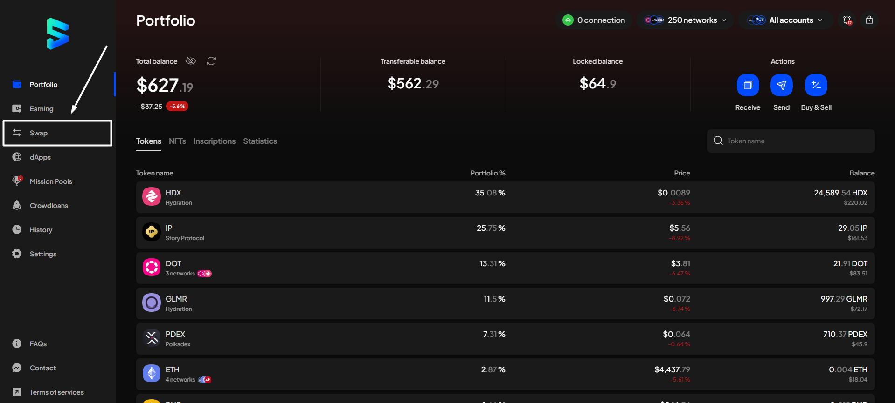

# Single-chain swap

## Supported swap pairs & swap providers

SubWallet supports single-chain token swaps on the following networks:

<table><thead><tr><th width="198">Network name</th><th>Swap provider</th><th width="340">Supported swap pair</th></tr></thead><tbody><tr><td>Hydration</td><td>Hydration</td><td>300+ swap pairs from 30+ tokens (DOT, GLMR, HDX, etc.)</td></tr><tr><td>Polkadot Asset Hub</td><td>Polkadot Asset Hub</td><td><ul><li>DOT &#x3C;> USDC</li><li>DOT &#x3C;> USDT</li><li>USDC &#x3C;> USDT</li></ul></td></tr><tr><td>Ethereum</td><td><ul><li>ChainFlip</li><li>SimpleSwap*</li><li>Uniswap*</li><li>KyberSwap*</li></ul></td><td><ul><li>ETH &#x3C;> USDC</li><li>ETH &#x3C;> USDT</li><li>USDC &#x3C;> USDT</li><li>ETH &#x3C;> FLIP</li><li>USDC &#x3C;> FLIP</li><li>USDT &#x3C;> FLIP</li><li>WBTC &#x3C;> ETH**</li></ul></td></tr><tr><td>Arbitrum One</td><td><ul><li>ChainFlip</li><li>Uniswap</li></ul></td><td><ul><li>ETH &#x3C;> USDC</li><li>ETH &#x3C;> USDT**</li><li>ETH &#x3C;> ARB**</li><li>ETH &#x3C;> WBTC**</li></ul></td></tr><tr><td>13 EVM networks</td><td>Uniswap Labs Trading API</td><td>1000+ swap pairs across 13 networks</td></tr><tr><td>10+ EVM networks</td><td>KyberSwap</td><td>1000+ swap pairs across 10+ networks</td></tr></tbody></table>

_(\*): SimpleSwap doesn't support swap pairs involving the FLIP token._

_(\*\*): Available **only** for swapping via Uniswap Trading Labs API._


With single-chain swap, you can only swap tokens within the account you want to swap (i.e., tokens can't be swapped from one account to another).


## Swap tokens via Hydration, Polkadot Asset Hub, ChainFlip, SimpleSwap & KyberSwap

**Step 1**: On the SubWallet homepage, select the "**Swap**" tab on the sidebar.

<figure><figcaption></figcaption></figure>


If this is the first time you click the button, the Terms of service popup will appear. Read carefully, then select "**I understand the associated risk and will act under caution**". After that, click "**Confirm and continue swapping**".

  



**Step 2**: On the Swap screen, enter the required information. This includes:

* The token you want to swap
* The token you wish to receive
* The amount of tokens to swap

<figure><figcaption></figcaption></figure>

_In this example, we want to swap HDX for MYTH on the Hydration network._&#x20;

If you're in the "All accounts" mode

In this case, you will need to select the swapping account.

<figure><figcaption></figcaption></figure>

<figure><figcaption></figcaption></figure>



### Select the token you want to swap

Select "**HDX (Hydration)**" in this example.

<figure><figcaption></figcaption></figure>



### Select the token you wish to receive

Select "**MYTH (Hydration)**" in this example.


Ensure the token you want to swap and the token you wish to receive are on the same network; otherwise, check out this [guide](https://app.gitbook.com/o/CyPU0v2iA12ILmupTKub/s/-Lh39Kwxa1xxZM9WX_Bs/~/changes/705/extension-user-guide/swap-tokens/cross-chain-swap#swap-tokens).


<figure><figcaption></figcaption></figure>



### Enter the amount you want to swap

Enter the amount of the token you want to swap. Once done, the swap quote (with the related information) will appear.

<figure><figcaption></figcaption></figure>



If you want to change the slippage tolerance

To change the slippage tolerance, hit the  button in the Slippage field.&#x20;

<figure><figcaption></figcaption></figure>

A popup screen will appear on the right side. In the Slippage setting screen, select or enter your desired slippage tolerance and click "**Apply**".

<figure><figcaption></figcaption></figure>

<figure><figcaption></figcaption></figure>


You cannot change the slippage tolerance if the swap provider is ChainFlip or SimpleSwap:

* With ChainFlip, every swap has a fixed slippage tolerance of 2%.
* With SimpleSwap, the slippage tolerance can't be predicted as it varies based on market conditions, but it will never exceed 5%.


If you want to change the swap provider (ChainFlip/SimpleSwap/Uniswap/KyberSwap)


_This feature is available for swap pairs on the Ethereum network._


To do that, hit the "**<**" button on the Quote rate field.

<figure><figcaption></figcaption></figure>

A popup screen will appear on the right side. Select the provider you want to perform the swap, then click "**Confirm**".

<figure><figcaption></figcaption></figure>

<figure><figcaption></figcaption></figure>

You will see the newly updated quote.

<figure><figcaption></figcaption></figure>

A completed swapping request would look like the following image. Click "**Swap**" to proceed.

<figure><figcaption></figcaption></figure>

**Step 3**: Check your transaction details, then click "**Approve**" to proceed.

<figure><figcaption></figcaption></figure>


Swapping via SimpleSwap can take 5 to 60 minutes, depending on the market conditions.


**Step 4**: Your swapping request has been submitted!

<figure><figcaption></figcaption></figure>

You can either click "**Back to home**" to return to the homepage or "**View transaction**" to see transaction details in the History tab.


If you click "**View transaction**", SubWallet will show you the latest transaction record in your transaction history along with the extrinsic hash of the transfer.

.png>)


## Swap tokens via Uniswap


If you want to swap ETH on the Ethereum or the Arbitrum One network for other tokens, the swap process will be the same as swapping via other providers.

If you want to swap from other tokens on these 2 networks via Uniswap, follow the instructions below.


**Step 1**: On the SubWallet homepage, select the "**Swap**" tab on the sidebar.

<figure><figcaption></figcaption></figure>


If this is the first time you click the button, the Terms of service popup will appear. Read carefully, then select "**I understand the associated risk and will act under caution**". After that, click "**Confirm and continue swapping**".

  



**Step 2**: On the Swap screen, enter the required information. This includes:

* The token you want to swap
* The token you wish to receive
* The amount of tokens to swap

<figure><figcaption></figcaption></figure>

**Step 1**: On the SubWallet homepage, select the "**Swap**" tab on the sidebar.

<figure><figcaption></figcaption></figure>


If this is the first time you click the button, the Terms of service popup will appear. Read carefully, then select "**I understand the associated risk and will act under caution**". After that, click "**Confirm and continue swapping**".

  



**Step 2**: On the Swap screen, enter the required information. This includes:

* The token you want to swap
* The token you wish to receive
* The amount of tokens to swap

<figure><figcaption></figcaption></figure>

_In this example, we want to swap USDC for ETH on the Base Mainnet network via Uniswap._&#x20;

If you're in the "All accounts" mode

In this case, you will need to select the swapping account.

<figure><figcaption></figcaption></figure>

<figure><figcaption></figcaption></figure>



### Select the token you want to swap

Select "**USDC (Base Mainnet)**" in this example.

<figure><figcaption></figcaption></figure>



### Select the token you wish to receive

Select "**ETH (Base Mainnet)**" in this example.


Ensure the token you want to swap and the token you wish to receive are on the same network; otherwise, check out this [guide](https://app.gitbook.com/o/CyPU0v2iA12ILmupTKub/s/-Lh39Kwxa1xxZM9WX_Bs/~/changes/705/extension-user-guide/swap-tokens/cross-chain-swap#swap-tokens).


<figure><figcaption></figcaption></figure>



### Enter the amount you want to swap

Enter the amount of the token you want to swap. Once done, the swap quote (with the related information) will appear.



If you want to change the slippage tolerance

To change the slippage tolerance, hit the  button in the Slippage field.&#x20;

<figure><figcaption></figcaption></figure>

A popup screen will appear on the right side. In the Slippage setting screen, select or enter your desired slippage tolerance and click "**Apply**".

<figure><figcaption></figcaption></figure>

<figure><figcaption></figcaption></figure>


You cannot change the slippage tolerance if the swap provider is ChainFlip or SimpleSwap:

* With ChainFlip, every swap has a fixed slippage tolerance of 2%.
* With SimpleSwap, the slippage tolerance can't be predicted as it varies based on market conditions, but it will never exceed 5%.


If you want to change the swap provider (ChainFlip/SimpleSwap/Uniswap/KyberSwap)


_This feature is available for swap pairs on the Ethereum network._


To do that, hit the "**<**" button on the Quote rate field.

<figure><figcaption></figcaption></figure>

A popup screen will appear on the right side. Select the provider you want to perform the swap, then click "**Confirm**".

<figure><figcaption></figcaption></figure>

<figure><figcaption></figcaption></figure>

You will see the newly updated quote.

<figure><figcaption></figcaption></figure>

A completed swapping request would look like the following image. Click "**Swap**" to proceed.

<figure><figcaption></figcaption></figure>

**Step 3**: On the Confirmation screen, you will see that this transaction has the "Process" field. Click the button to view the details of the swapping process.

<figure><figcaption></figcaption></figure>

<figure><figcaption></figcaption></figure>

Click the "**X**" button to get out, then check your transaction details, then click "**Approve**" to proceed.

<figure><figcaption></figcaption></figure>


Swapping via SimpleSwap can take 5 to 60 minutes, depending on the market conditions.


**Step 4**: Your swapping request has been submitted!

You'll be directed to the new screen. From there, either click "**View progress**" to view the transaction progress in the Notifications screen or "**Back to home**" to return to the homepage.

<figure><figcaption></figcaption></figure>

If you select "**View progress**", you'll be directed to the Notifications screen. Click the swap-related notification to view progress.

<figure><figcaption></figcaption></figure>
